```r
library(stringr)
library(knitr)
library(tidyverse)
library(lubridate)
library(ggplot2)
library(forecast)
library(tseries)
library(formatR)
library(CausalImpact)
library(zoo)
library(normtest)
library(car)
library(Hmisc)
library(multcomp)

options(scipen = 2, digits=4)
opts_chunk$set(warning = FALSE, message = FALSE, error = FALSE, tidy = TRUE)
```


```r
city_data <- read.csv("https://raw.githubusercontent.com/walkabilly/Phillybikeshare/master/city_day_sum.csv")
member_data <- read.csv("https://raw.githubusercontent.com/walkabilly/Phillybikeshare/master/MemberColl.csv")
phil_temp16 <- read.csv("https://raw.githubusercontent.com/walkabilly/Phillybikeshare/master/Phil_temp_2016_new.csv")
```

### Convert start_time from factor to date and creating moving averages

```r
city_data$start_time <- ymd(city_data$start_time)
member_data$start_time <- mdy(member_data$start_time)

city_data <- city_data %>% arrange(desc(start_time), (desc(city)))

city_data <- city_data %>% group_by(city) %>% mutate(cnt_ma7 = rollmean(by100000, 
    k = 7, fill = by100000), cnt_ma30 = rollmean(by100000, k = 30, fill = by100000), 
    cnt_ma = rollmean(cnt_ma7, k = 30, fill = by100000))

member_data <- member_data %>% group_by(city, membertype) %>% mutate(cnt_ma7 = rollmean(by10000, 
    k = 7, fill = by10000), cnt_ma30 = rollmean(by10000, k = 30, fill = by10000), 
    cnt_ma = rollmean(cnt_ma7, k = 30, fill = by10000))
```

### Time Series Plot 

#### All bikeshare users (members and non-members)


```r
cityplot <- ggplot(data = city_data, aes(x = start_time, y = by100000)) + geom_line() + 
    stat_smooth(aes(group = dummy), method = "lm", formula = y ~ poly(x, 2), 
        se = FALSE) + geom_vline(xintercept = as.numeric(city_data$start_time[""]), 
    linetype = 4) + facet_wrap(~city) + theme_classic()


plot(cityplot)
```

<!-- -->

#### Data cleaning Bikeshare member type by city

#### Philadelphia


```r
philly_mem_data <- filter(member_data, city == "Philly")

philly_member_plot <- ggplot(data = philly_mem_data, aes(x = start_time, y = by10000)) + 
    geom_line() + stat_smooth(aes(group = dummy), method = "lm", formula = y ~ 
    poly(x, 2), se = FALSE) + geom_vline(xintercept = as.numeric(city_data$start_time[1215]), 
    linetype = 4) + facet_wrap(~membertype) + theme_classic()

plot(philly_member_plot)
```

<!-- -->

#### Boston


```r
boston_mem_data <- filter(member_data, city == "Boston")

boston_member_plot <- ggplot(data = boston_mem_data, aes(x = start_time, y = by10000)) + 
    geom_line() + stat_smooth(aes(group = dummy), method = "lm", formula = y ~ 
    poly(x, 2), se = FALSE) + geom_vline(xintercept = as.numeric(city_data$start_time[1215]), 
    linetype = 4) + facet_wrap(~membertype) + theme_classic()

plot(boston_member_plot)
```

<!-- -->

#### Chicago


```r
chicago_mem_data <- filter(member_data, city == "Chicago")

chicago_member_plot <- ggplot(data = chicago_mem_data, aes(x = start_time, y = by10000)) + 
    geom_line() + stat_smooth(aes(group = dummy), method = "lm", formula = y ~ 
    poly(x, 2), se = FALSE) + geom_vline(xintercept = as.numeric(city_data$start_time[1215]), 
    linetype = 4) + facet_wrap(~membertype) + theme_classic()

plot(chicago_member_plot)
```

<!-- -->

#### Washington


```r
washington_mem_data <- filter(member_data, city == "Washington")

washington_member_plot <- ggplot(data = washington_mem_data, aes(x = start_time, 
    y = by10000)) + geom_line() + stat_smooth(aes(group = dummy), method = "lm", 
    formula = y ~ poly(x, 2), se = FALSE) + geom_vline(xintercept = as.numeric(city_data$start_time[1215]), 
    linetype = 4) + facet_wrap(~membertype) + theme_classic()

plot(washington_member_plot)
```

<!-- -->

### Trip duration time series plot

```r
Philly_dur_data <- filter(city_data, city == "Philly")

cityplot_dur_Philly <- ggplot(data = Philly_dur_data, aes(x = start_time, y = mDuration/60)) + 
    geom_line() + stat_smooth(aes(group = dummy), method = "lm", formula = y ~ 
    poly(x, 2), se = FALSE) + geom_vline(xintercept = as.numeric(city_data$start_time[""]), 
    linetype = 4) + facet_wrap(~city) + theme_classic()


plot(cityplot_dur_Philly)
```

<!-- -->

### Data analysis

#### Moving Averages


```r
smooth_plot <- ggplot(city_data) + geom_line(aes(x = start_time, y = by100000, 
    colour = "Count")) + geom_line(aes(x = start_time, y = cnt_ma7, colour = "Weekly Moving Average")) + 
    geom_line(aes(x = start_time, y = cnt_ma30, colour = "Monthly Moving Average")) + 
    geom_vline(xintercept = as.numeric(city_data$start_time[1215]), linetype = 4) + 
    facet_wrap(~city) + theme_classic() + ylab("Number of Trips x 100000 person")
plot(smooth_plot)
```

<!-- -->

# Modelling


```r
trip_Philly <- arrange(dplyr::select(filter(city_data, city == "Philly"), by100000, 
    dummy, start_time), start_time)
trip_Boston <- arrange(dplyr::select(filter(city_data, city == "Boston"), by100000, 
    start_time), start_time)
trip_Washington <- arrange(dplyr::select(filter(city_data, city == "Washington"), 
    by100000, start_time), start_time)
trip_Chicago <- arrange(dplyr::select(filter(city_data, city == "Chicago"), 
    by100000, start_time), start_time)

time <- 1:366
```


## Model 1: Linear Model on Trips per 100K people
### Covariates: 
###1. daily average temperature
###2. daily average precipitation
###3. dummy varaible: 0 - no strike, 1 - strike
###4. Trips per 100K, Boston
###5. Trips per 100K, Washington DC
###6. Trips per 100K, Chicago
###7. time
###8. Interaction between time and dummy


```r
## Model 1.1
lm_tripRate <- lm(trip_Philly$by100000 ~ phil_temp16$MEAN + phil_temp16$PRCP + 
    trip_Philly$dummy + trip_Boston$by100000 + trip_Washington$by100000 + trip_Chicago$by100000 + 
    time + time * trip_Philly$dummy)

table3_1 <- cbind(lm_tripRate$coefficients, confint(lm_tripRate))

table3_1
```

```
##                                         2.5 %     97.5 %
## (Intercept)               -3.20453 -11.279735   4.870679
## phil_temp16$MEAN          -0.20531  -0.406747  -0.003868
## phil_temp16$PRCP          -4.92007  -8.948463  -0.891668
## trip_Philly$dummy        439.48579 352.182945 526.788633
## trip_Boston$by100000       0.07405   0.062074   0.086017
## trip_Washington$by100000   0.04966   0.043927   0.055388
## trip_Chicago$by100000      0.01614  -0.001058   0.033339
## time                       0.10021   0.065426   0.134985
## trip_Philly$dummy:time    -1.29006  -1.559058  -1.021068
```

```r
tripPhilly_fitted <- lm_tripRate$fitted.values

lm_plot_tripRate <- ggplot(data = trip_Philly) + # geom_line(aes(x = start_time, y = by100000, colour='Observed data')) +
# geom_line(aes(x = start_time, y = tripPhilly_fitted, colour = 'Fitted
# data')) +
geom_line(aes(x = start_time, y = by100000), colour = "black") + geom_line(aes(x = start_time, 
    y = tripPhilly_fitted), colour = "gray70", linetype = "dashed") + theme_classic() + 
    xlab("") + ylab("Trips per 100K people") + scale_colour_discrete(name = "")

plot(lm_plot_tripRate)
```

<!-- -->


## Model 1.2
### Accounting for the potential quadratic trend of the data (time squared). This term captures the curvature of the trend

```r
lm_tripRate2 <- lm(trip_Philly$by100000 ~ phil_temp16$MEAN + phil_temp16$PRCP + 
    trip_Philly$dummy + trip_Boston$by100000 + trip_Washington$by100000 + trip_Chicago$by100000 + 
    poly(time, 2) + I(time^2) * trip_Philly$dummy)  ##Code for time squared interaction is I(time^2)*trip_Philly$dummy

summary(lm_tripRate2)
```

```
## 
## Call:
## lm(formula = trip_Philly$by100000 ~ phil_temp16$MEAN + phil_temp16$PRCP + 
##     trip_Philly$dummy + trip_Boston$by100000 + trip_Washington$by100000 + 
##     trip_Chicago$by100000 + poly(time, 2) + I(time^2) * trip_Philly$dummy)
## 
## Residuals:
##    Min     1Q Median     3Q    Max 
## -77.96  -7.87   0.38   7.20  71.70 
## 
## Coefficients: (1 not defined because of singularities)
##                               Estimate Std. Error t value Pr(>|t|)    
## (Intercept)                  -8.897797   6.087397   -1.46   0.1447    
## phil_temp16$MEAN              0.019346   0.103309    0.19   0.8516    
## phil_temp16$PRCP             -4.021126   1.951224   -2.06   0.0400 *  
## trip_Philly$dummy           227.097678  20.635127   11.01  < 2e-16 ***
## trip_Boston$by100000          0.082573   0.005923   13.94  < 2e-16 ***
## trip_Washington$by100000      0.052135   0.002792   18.67  < 2e-16 ***
## trip_Chicago$by100000         0.027976   0.008484    3.30   0.0011 ** 
## poly(time, 2)1              174.426102  34.157432    5.11  5.4e-07 ***
## poly(time, 2)2              232.337800  35.471696    6.55  2.0e-10 ***
## I(time^2)                           NA         NA      NA       NA    
## trip_Philly$dummy:I(time^2)  -0.002017   0.000194  -10.39  < 2e-16 ***
## ---
## Signif. codes:  0 '***' 0.001 '**' 0.01 '*' 0.05 '.' 0.1 ' ' 1
## 
## Residual standard error: 15.5 on 356 degrees of freedom
## Multiple R-squared:  0.927,	Adjusted R-squared:  0.925 
## F-statistic:  501 on 9 and 356 DF,  p-value: <2e-16
```

```r
tripPhilly_fitted2 <- lm_tripRate2$fitted.values
lm_plot_tripRate2 <- ggplot(trip_Philly) + geom_line(aes(x = start_time, y = by100000, 
    colour = "Observed data")) + geom_line(aes(x = start_time, y = tripPhilly_fitted2, 
    colour = "Fitted data")) + theme_classic() + xlab("") + ylab("Trips per 100K people") + 
    scale_colour_discrete(name = "")

plot(lm_plot_tripRate2)
```

<!-- -->

## Model 1.3
### Three time-periods: pre-strike, strike, post-strike

```r
## Create a new category variable rather than a dummy variable
category <- factor(c(rep(1, 305), rep(2, 7), rep(3, 54)))
time_strike <- c(rep(0, 305), 1:7, rep(0, 54))
time_post <- c(rep(0, 312), 1:54)

lm_tripRate3 <- lm(trip_Philly$by100000 ~ phil_temp16$MEAN + phil_temp16$PRCP + 
    category + trip_Boston$by100000 + trip_Washington$by100000 + trip_Chicago$by100000 + 
    time + time_strike + time_post)

summary(lm_tripRate3)
```

```
## 
## Call:
## lm(formula = trip_Philly$by100000 ~ phil_temp16$MEAN + phil_temp16$PRCP + 
##     category + trip_Boston$by100000 + trip_Washington$by100000 + 
##     trip_Chicago$by100000 + time + time_strike + time_post)
## 
## Residuals:
##    Min     1Q Median     3Q    Max 
## -55.72  -7.67   1.04   8.76  67.06 
## 
## Coefficients:
##                          Estimate Std. Error t value Pr(>|t|)    
## (Intercept)              -2.64215    3.69248   -0.72    0.475    
## phil_temp16$MEAN         -0.17135    0.09218   -1.86    0.064 .  
## phil_temp16$PRCP         -4.50111    1.84156   -2.44    0.015 *  
## category2                92.85722   12.69274    7.32  1.7e-12 ***
## category3                12.65185    4.96117    2.55    0.011 *  
## trip_Boston$by100000      0.07694    0.00550   13.99  < 2e-16 ***
## trip_Washington$by100000  0.04841    0.00262   18.46  < 2e-16 ***
## trip_Chicago$by100000     0.00840    0.00792    1.06    0.289    
## time                      0.10404    0.01590    6.54  2.1e-10 ***
## time_strike              -2.95407    2.78840   -1.06    0.290    
## time_post                -0.66057    0.14023   -4.71  3.5e-06 ***
## ---
## Signif. codes:  0 '***' 0.001 '**' 0.01 '*' 0.05 '.' 0.1 ' ' 1
## 
## Residual standard error: 14.7 on 355 degrees of freedom
## Multiple R-squared:  0.935,	Adjusted R-squared:  0.933 
## F-statistic:  508 on 10 and 355 DF,  p-value: <2e-16
```

```r
coef_diff_all <- lm_tripRate3$coefficients[4] - lm_tripRate3$coefficients[5]
coef_diff_all
```

```
## category2 
##     80.21
```

```r
K_matrix <- matrix(c(rep(0, 3), -1, 1, rep(0, 6)), 1)
t_all <- glht(lm_tripRate3, K_matrix)
summary(t_all)
```

```
## 
## 	 Simultaneous Tests for General Linear Hypotheses
## 
## Fit: lm(formula = trip_Philly$by100000 ~ phil_temp16$MEAN + phil_temp16$PRCP + 
##     category + trip_Boston$by100000 + trip_Washington$by100000 + 
##     trip_Chicago$by100000 + time + time_strike + time_post)
## 
## Linear Hypotheses:
##        Estimate Std. Error t value Pr(>|t|)    
## 1 == 0    -80.2       13.1   -6.11  2.5e-09 ***
## ---
## Signif. codes:  0 '***' 0.001 '**' 0.01 '*' 0.05 '.' 0.1 ' ' 1
## (Adjusted p values reported -- single-step method)
```

```r
confint(t_all)
```

```
## 
## 	 Simultaneous Confidence Intervals
## 
## Fit: lm(formula = trip_Philly$by100000 ~ phil_temp16$MEAN + phil_temp16$PRCP + 
##     category + trip_Boston$by100000 + trip_Washington$by100000 + 
##     trip_Chicago$by100000 + time + time_strike + time_post)
## 
## Quantile = 1.967
## 95% family-wise confidence level
##  
## 
## Linear Hypotheses:
##        Estimate lwr      upr     
## 1 == 0  -80.205 -106.001  -54.410
```

```r
table3_2 <- cbind(lm_tripRate3$coefficients, confint(lm_tripRate3))

table3_2
```

```
##                                        2.5 %     97.5 %
## (Intercept)              -2.642150 -9.904029   4.619730
## phil_temp16$MEAN         -0.171350 -0.352641   0.009941
## phil_temp16$PRCP         -4.501109 -8.122855  -0.879363
## category2                92.857223 67.894799 117.819647
## category3                12.651853  2.894881  22.408825
## trip_Boston$by100000      0.076943  0.066125   0.087762
## trip_Washington$by100000  0.048408  0.043251   0.053565
## trip_Chicago$by100000     0.008402 -0.007165   0.023968
## time                      0.104045  0.072771   0.135318
## time_strike              -2.954073 -8.437940   2.529794
## time_post                -0.660566 -0.936349  -0.384783
```

```r
tripPhilly_fitted3 <- lm_tripRate3$fitted.values

lm_plot_tripRate3 <- ggplot(data = trip_Philly) + geom_line(aes(x = start_time, 
    y = by100000, colour = "Observed data")) + geom_line(aes(x = start_time, 
    y = tripPhilly_fitted3, colour = "Fitted data")) + # geom_line(aes(x = start_time, y = by100000), colour = 'black') +
# geom_line(aes(x = start_time, y = tripPhilly_fitted3), colour = 'gray70',
# linetype = 'dashed') +
theme_classic() + xlab("") + ylab("Trips per 100K people") + scale_colour_discrete(name = "")

plot(lm_plot_tripRate3)
```

<!-- -->


### Model2: Linear model on Trips per 100K people, weekly moving average

```r
trip_Philly_MA <- arrange(dplyr::select(filter(city_data, city == "Philly"), 
    cnt_ma7, dummy, start_time), start_time)
trip_Boston_MA <- arrange(dplyr::select(filter(city_data, city == "Boston"), 
    cnt_ma7, start_time), start_time)
trip_Washington_MA <- arrange(dplyr::select(filter(city_data, city == "Washington"), 
    cnt_ma7, start_time), start_time)
trip_Chicago_MA <- arrange(dplyr::select(filter(city_data, city == "Chicago"), 
    cnt_ma7, start_time), start_time)

time_MA <- 1:366

## Model 2.1
lm_tripRate_MA <- lm(trip_Philly_MA$cnt_ma7 ~ phil_temp16$MEAN + phil_temp16$PRCP + 
    trip_Philly_MA$dummy + trip_Boston_MA$cnt_ma7 + trip_Washington_MA$cnt_ma7 + 
    trip_Chicago_MA$cnt_ma7 + time_MA + time_MA * trip_Philly_MA$dummy)

summary(lm_tripRate_MA)
```

```
## 
## Call:
## lm(formula = trip_Philly_MA$cnt_ma7 ~ phil_temp16$MEAN + phil_temp16$PRCP + 
##     trip_Philly_MA$dummy + trip_Boston_MA$cnt_ma7 + trip_Washington_MA$cnt_ma7 + 
##     trip_Chicago_MA$cnt_ma7 + time_MA + time_MA * trip_Philly_MA$dummy)
## 
## Residuals:
##    Min     1Q Median     3Q    Max 
## -25.38  -5.13  -0.89   4.61  44.54 
## 
## Coefficients:
##                               Estimate Std. Error t value Pr(>|t|)    
## (Intercept)                    0.47957    2.52382    0.19    0.849    
## phil_temp16$MEAN              -0.05598    0.06324   -0.89    0.377    
## phil_temp16$PRCP              -2.07002    1.05991   -1.95    0.052 .  
## trip_Philly_MA$dummy         494.08115   25.43266   19.43  < 2e-16 ***
## trip_Boston_MA$cnt_ma7         0.04385    0.00696    6.30  8.7e-10 ***
## trip_Washington_MA$cnt_ma7     0.03184    0.00239   13.30  < 2e-16 ***
## trip_Chicago_MA$cnt_ma7        0.06415    0.01004    6.39  5.2e-10 ***
## time_MA                        0.16211    0.01149   14.11  < 2e-16 ***
## trip_Philly_MA$dummy:time_MA  -1.49234    0.07944  -18.79  < 2e-16 ***
## ---
## Signif. codes:  0 '***' 0.001 '**' 0.01 '*' 0.05 '.' 0.1 ' ' 1
## 
## Residual standard error: 8.56 on 357 degrees of freedom
## Multiple R-squared:  0.972,	Adjusted R-squared:  0.972 
## F-statistic: 1.56e+03 on 8 and 357 DF,  p-value: <2e-16
```

```r
tripPhilly_fitted_MA <- lm_tripRate_MA$fitted.values
lm_plot_tripRate_MA <- ggplot(trip_Philly_MA) + geom_line(aes(x = start_time, 
    y = cnt_ma7)) + geom_line(aes(x = start_time, y = tripPhilly_fitted_MA, 
    colour = "#339999")) + theme_classic() + ylab("Trips per 100K people_Weekly moving average")

plot(lm_plot_tripRate_MA)
```

<!-- -->

```r
### Accounting for the potential quadratic trend of the data (time squared).
### This term captures the curvature of the trend
lm_tripRate_MA2 <- lm(trip_Philly_MA$cnt_ma7 ~ phil_temp16$MEAN + phil_temp16$PRCP + 
    trip_Philly_MA$dummy + trip_Boston_MA$cnt_ma7 + trip_Washington_MA$cnt_ma7 + 
    trip_Chicago_MA$cnt_ma7 + poly(time_MA, 2) + time_MA * trip_Philly_MA$dummy)

summary(lm_tripRate_MA2)
```

```
## 
## Call:
## lm(formula = trip_Philly_MA$cnt_ma7 ~ phil_temp16$MEAN + phil_temp16$PRCP + 
##     trip_Philly_MA$dummy + trip_Boston_MA$cnt_ma7 + trip_Washington_MA$cnt_ma7 + 
##     trip_Chicago_MA$cnt_ma7 + poly(time_MA, 2) + time_MA * trip_Philly_MA$dummy)
## 
## Residuals:
##    Min     1Q Median     3Q    Max 
## -21.00  -3.94   0.19   3.05  41.87 
## 
## Coefficients: (1 not defined because of singularities)
##                               Estimate Std. Error t value Pr(>|t|)    
## (Intercept)                    2.99663    3.47792    0.86     0.39    
## phil_temp16$MEAN               0.00815    0.05421    0.15     0.88    
## phil_temp16$PRCP              -1.03678    0.90820   -1.14     0.25    
## trip_Philly_MA$dummy         459.80923   21.88739   21.01  < 2e-16 ***
## trip_Boston_MA$cnt_ma7         0.06572    0.00623   10.55  < 2e-16 ***
## trip_Washington_MA$cnt_ma7     0.04036    0.00217   18.60  < 2e-16 ***
## trip_Chicago_MA$cnt_ma7        0.06645    0.00857    7.76  9.2e-14 ***
## poly(time_MA, 2)1            242.54460   21.11415   11.49  < 2e-16 ***
## poly(time_MA, 2)2            220.20554   18.95659   11.62  < 2e-16 ***
## time_MA                             NA         NA      NA       NA    
## trip_Philly_MA$dummy:time_MA  -1.39224    0.06829  -20.39  < 2e-16 ***
## ---
## Signif. codes:  0 '***' 0.001 '**' 0.01 '*' 0.05 '.' 0.1 ' ' 1
## 
## Residual standard error: 7.3 on 356 degrees of freedom
## Multiple R-squared:  0.98,	Adjusted R-squared:  0.979 
## F-statistic: 1.92e+03 on 9 and 356 DF,  p-value: <2e-16
```

```r
tripPhilly_fitted_MA2 <- lm_tripRate_MA2$fitted.values
lm_plot_tripRate_MA2 <- ggplot(trip_Philly_MA) + geom_line(aes(x = start_time, 
    y = cnt_ma7)) + geom_line(aes(x = start_time, y = tripPhilly_fitted_MA2, 
    colour = "#339999")) + theme_classic() + ylab("Trips per 100K people_Weekly moving average")

plot(lm_plot_tripRate_MA2)
```

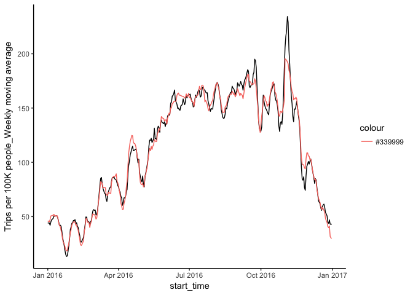<!-- -->

#### Trip duration as the outcome


```r
trip_Philly_dur <- arrange(dplyr::select(filter(city_data, city == "Philly"), 
    mDuration, dummy, start_time), start_time)
trip_Boston_dur <- arrange(dplyr::select(filter(city_data, city == "Boston"), 
    mDuration, start_time), start_time)
trip_Washington_dur <- arrange(dplyr::select(filter(city_data, city == "Washington"), 
    mDuration, start_time), start_time)
trip_Chicago_dur <- arrange(dplyr::select(filter(city_data, city == "Chicago"), 
    mDuration, start_time), start_time)

time_dur <- 1:366
Philly_dur <- trip_Philly_dur$mDuration/60
Boston_dur <- trip_Boston_dur$mDuration/60
Washington_dur <- trip_Washington_dur$mDuration/60
Chicago_dur <- trip_Chicago_dur$mDuration/60

lm_tripRate_dur <- lm(Philly_dur ~ phil_temp16$MEAN + phil_temp16$PRCP + trip_Philly_dur$dummy + 
    Boston_dur + Washington_dur + Chicago_dur + time_dur + time_dur * trip_Philly_dur$dummy)

summary(lm_tripRate_dur)
```

```
## 
## Call:
## lm(formula = Philly_dur ~ phil_temp16$MEAN + phil_temp16$PRCP + 
##     trip_Philly_dur$dummy + Boston_dur + Washington_dur + Chicago_dur + 
##     time_dur + time_dur * trip_Philly_dur$dummy)
## 
## Residuals:
##    Min     1Q Median     3Q    Max 
## -20.98  -3.56  -0.98   1.61 227.93 
## 
## Coefficients:
##                                  Estimate Std. Error t value  Pr(>|t|)    
## (Intercept)                     16.175529   3.381797    4.78 0.0000025 ***
## phil_temp16$MEAN                -0.106511   0.067413   -1.58     0.115    
## phil_temp16$PRCP                -0.060304   1.693882   -0.04     0.972    
## trip_Philly_dur$dummy          -53.275400  34.609422   -1.54     0.125    
## Boston_dur                      -0.020461   0.030891   -0.66     0.508    
## Washington_dur                   0.000561   0.000243    2.31     0.022 *  
## Chicago_dur                      0.654288   0.346534    1.89     0.060 .  
## time_dur                        -0.034407   0.012683   -2.71     0.007 ** 
## trip_Philly_dur$dummy:time_dur   0.177438   0.105311    1.68     0.093 .  
## ---
## Signif. codes:  0 '***' 0.001 '**' 0.01 '*' 0.05 '.' 0.1 ' ' 1
## 
## Residual standard error: 13.7 on 357 degrees of freedom
## Multiple R-squared:  0.109,	Adjusted R-squared:  0.089 
## F-statistic: 5.46 on 8 and 357 DF,  p-value: 0.00000167
```

## Model 3: Trip rate_membership as the outcome

```r
trip_Philly_mem <- arrange(dplyr::select(filter(member_data, city == "Philly" & 
    membertype == "member"), by10000, dummy, start_time), start_time)  ##Two-day data missing 01-23 and 01-24
trip_Boston_mem <- arrange(dplyr::select(filter(member_data, city == "Boston" & 
    membertype == "member"), by10000, start_time), start_time)
trip_Washington_mem <- arrange(dplyr::select(filter(member_data, city == "Washington" & 
    membertype == "member"), by10000, start_time), start_time)  ##Four-day data missing: 01-23 ~ 01-26
trip_Chicago_mem <- arrange(dplyr::select(filter(member_data, city == "Chicago" & 
    membertype == "member"), by10000, start_time), start_time)

time_mem <- 1:366

## Fill in the missing data
trip_Philly_mem[365, "start_time"] <- "2016-01-23"
trip_Philly_mem[366, "start_time"] <- "2016-01-24"
trip_Philly_mem <- arrange(trip_Philly_mem, start_time)

trip_Washington_mem[363, "start_time"] <- "2016-01-23"
trip_Washington_mem[364, "start_time"] <- "2016-01-24"
trip_Washington_mem[365, "start_time"] <- "2016-01-25"
trip_Washington_mem[366, "start_time"] <- "2016-01-26"
trip_Washington_mem <- arrange(trip_Washington_mem, start_time)

Philly_mem <- trip_Philly_mem$by10000 * 10
Boston_mem <- trip_Boston_mem$by10000 * 10
Washington_mem <- trip_Washington_mem$by10000 * 10
Chicago_mem <- trip_Chicago_mem$by10000 * 10

## Model 3.1
lm_tripRate_mem <- lm(Philly_mem ~ phil_temp16$MEAN + phil_temp16$PRCP + trip_Philly_mem$dummy + 
    Boston_mem + Washington_mem + Chicago_mem + time_mem + time_mem * trip_Philly_mem$dummy)
summary(lm_tripRate_mem)
```

```
## 
## Call:
## lm(formula = Philly_mem ~ phil_temp16$MEAN + phil_temp16$PRCP + 
##     trip_Philly_mem$dummy + Boston_mem + Washington_mem + Chicago_mem + 
##     time_mem + time_mem * trip_Philly_mem$dummy)
## 
## Residuals:
##    Min     1Q Median     3Q    Max 
## -63.88  -6.01   0.28   7.39  42.10 
## 
## Coefficients:
##                                 Estimate Std. Error t value Pr(>|t|)    
## (Intercept)                    -12.01351    3.47387   -3.46  0.00061 ***
## phil_temp16$MEAN                -0.08385    0.06582   -1.27  0.20352    
## phil_temp16$PRCP                -6.06063    1.56908   -3.86  0.00013 ***
## trip_Philly_mem$dummy          336.00202   33.47383   10.04  < 2e-16 ***
## Boston_mem                       0.06056    0.00615    9.84  < 2e-16 ***
## Washington_mem                   0.05232    0.00306   17.10  < 2e-16 ***
## Chicago_mem                      0.02790    0.01175    2.37  0.01817 *  
## time_mem                         0.13474    0.01343   10.03  < 2e-16 ***
## trip_Philly_mem$dummy:time_mem  -1.01385    0.10265   -9.88  < 2e-16 ***
## ---
## Signif. codes:  0 '***' 0.001 '**' 0.01 '*' 0.05 '.' 0.1 ' ' 1
## 
## Residual standard error: 12.6 on 353 degrees of freedom
##   (4 observations deleted due to missingness)
## Multiple R-squared:  0.932,	Adjusted R-squared:  0.93 
## F-statistic:  604 on 8 and 353 DF,  p-value: <2e-16
```

```r
table3_3 <- cbind(lm_tripRate_mem$coefficients, confint(lm_tripRate_mem))

table3_3
```

```
##                                               2.5 %    97.5 %
## (Intercept)                    -12.01351 -18.845592  -5.18142
## phil_temp16$MEAN                -0.08385  -0.213290   0.04560
## phil_temp16$PRCP                -6.06063  -9.146556  -2.97471
## trip_Philly_mem$dummy          336.00202 270.168800 401.83525
## Boston_mem                       0.06056   0.048460   0.07267
## Washington_mem                   0.05232   0.046299   0.05833
## Chicago_mem                      0.02790   0.004779   0.05101
## time_mem                         0.13474   0.108328   0.16115
## trip_Philly_mem$dummy:time_mem  -1.01385  -1.215721  -0.81197
```

```r
tripPhilly_fitted_mem <- lm_tripRate_mem$fitted.values
fitted_all <- vector(length = 366)
fitted_all[1:22] <- tripPhilly_fitted_mem[1:22]
fitted_all[23:26] <- NA
fitted_all[27:366] <- tripPhilly_fitted_mem[23:362]

lm_plot_mem <- ggplot(trip_Philly_mem) + geom_line(aes(x = start_time, y = Philly_mem, 
    colour = "Observed data")) + geom_line(aes(x = start_time, y = fitted_all, 
    colour = "Fitted data")) + theme_classic() + xlab("") + ylab("Trips per 100K people") + 
    scale_colour_discrete(name = "")

plot(lm_plot_mem)
```

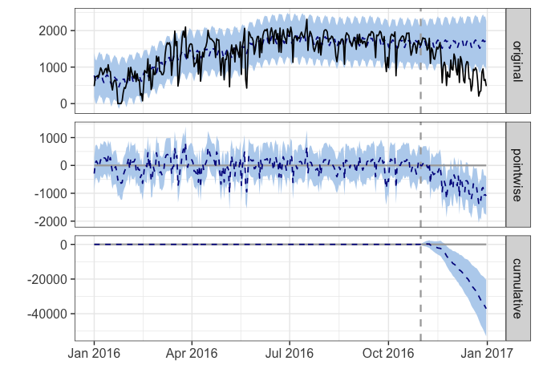<!-- -->

```r
## Model 3.2: Three time-periods: pre-strike, strike, post-strike
lm_tripRate_mem2 <- lm(Philly_mem ~ phil_temp16$MEAN + phil_temp16$PRCP + category + 
    Boston_mem + Washington_mem + Chicago_mem + time_mem + time_strike + time_post)
summary(lm_tripRate_mem2)
```

```
## 
## Call:
## lm(formula = Philly_mem ~ phil_temp16$MEAN + phil_temp16$PRCP + 
##     category + Boston_mem + Washington_mem + Chicago_mem + time_mem + 
##     time_strike + time_post)
## 
## Residuals:
##    Min     1Q Median     3Q    Max 
## -52.50  -6.59   0.51   7.73  34.87 
## 
## Coefficients:
##                   Estimate Std. Error t value Pr(>|t|)    
## (Intercept)      -10.96019    3.32277   -3.30  0.00107 ** 
## phil_temp16$MEAN  -0.08566    0.06291   -1.36  0.17421    
## phil_temp16$PRCP  -5.78052    1.49946   -3.86  0.00014 ***
## category2         41.38963   10.39958    3.98  8.4e-05 ***
## category3          7.26699    4.01813    1.81  0.07138 .  
## Boston_mem         0.06368    0.00591   10.78  < 2e-16 ***
## Washington_mem     0.05174    0.00293   17.68  < 2e-16 ***
## Chicago_mem        0.02255    0.01127    2.00  0.04613 *  
## time_mem           0.13433    0.01283   10.47  < 2e-16 ***
## time_strike        0.62797    2.27978    0.28  0.78313    
## time_post         -0.67906    0.11312   -6.00  4.8e-09 ***
## ---
## Signif. codes:  0 '***' 0.001 '**' 0.01 '*' 0.05 '.' 0.1 ' ' 1
## 
## Residual standard error: 12 on 351 degrees of freedom
##   (4 observations deleted due to missingness)
## Multiple R-squared:  0.938,	Adjusted R-squared:  0.936 
## F-statistic:  533 on 10 and 351 DF,  p-value: <2e-16
```

```r
coef_diff_mem <- lm_tripRate_mem2$coefficients[4] - lm_tripRate_mem2$coefficients[5]
coef_diff_mem
```

```
## category2 
##     34.12
```

```r
t_mem <- glht(lm_tripRate_mem2, K_matrix)
summary(t_mem)
```

```
## 
## 	 Simultaneous Tests for General Linear Hypotheses
## 
## Fit: lm(formula = Philly_mem ~ phil_temp16$MEAN + phil_temp16$PRCP + 
##     category + Boston_mem + Washington_mem + Chicago_mem + time_mem + 
##     time_strike + time_post)
## 
## Linear Hypotheses:
##        Estimate Std. Error t value Pr(>|t|)   
## 1 == 0    -34.1       10.7   -3.18   0.0016 **
## ---
## Signif. codes:  0 '***' 0.001 '**' 0.01 '*' 0.05 '.' 0.1 ' ' 1
## (Adjusted p values reported -- single-step method)
```

```r
confint(t_mem)
```

```
## 
## 	 Simultaneous Confidence Intervals
## 
## Fit: lm(formula = Philly_mem ~ phil_temp16$MEAN + phil_temp16$PRCP + 
##     category + Boston_mem + Washington_mem + Chicago_mem + time_mem + 
##     time_strike + time_post)
## 
## Quantile = 1.967
## 95% family-wise confidence level
##  
## 
## Linear Hypotheses:
##        Estimate lwr     upr    
## 1 == 0 -34.123  -55.211 -13.034
```

```r
table3_4 <- cbind(lm_tripRate_mem2$coefficients, confint(lm_tripRate_mem2))

table3_4
```

```
##                                  2.5 %   97.5 %
## (Intercept)      -10.96019 -17.4952407 -4.42514
## phil_temp16$MEAN  -0.08566  -0.2093914  0.03807
## phil_temp16$PRCP  -5.78052  -8.7295772 -2.83147
## category2         41.38963  20.9363034 61.84296
## category3          7.26699  -0.6356409 15.16963
## Boston_mem         0.06368   0.0520555  0.07530
## Washington_mem     0.05174   0.0459856  0.05750
## Chicago_mem        0.02255   0.0003893  0.04472
## time_mem           0.13433   0.1090968  0.15957
## time_strike        0.62797  -3.8557765  5.11173
## time_post         -0.67906  -0.9015333 -0.45658
```

```r
tripPhilly_fitted_mem2 <- lm_tripRate_mem2$fitted.values
fitted_all2 <- vector(length = 366)
fitted_all2[1:22] <- tripPhilly_fitted_mem2[1:22]
fitted_all2[23:26] <- NA
fitted_all2[27:366] <- tripPhilly_fitted_mem2[23:362]

lm_plot_mem2 <- ggplot(trip_Philly_mem) + geom_line(aes(x = start_time, y = Philly_mem, 
    colour = "Observed data")) + geom_line(aes(x = start_time, y = fitted_all2, 
    colour = "Fitted data")) + theme_classic() + xlab("") + ylab("Trips per 100K people") + 
    scale_colour_discrete(name = "")

plot(lm_plot_mem2)
```

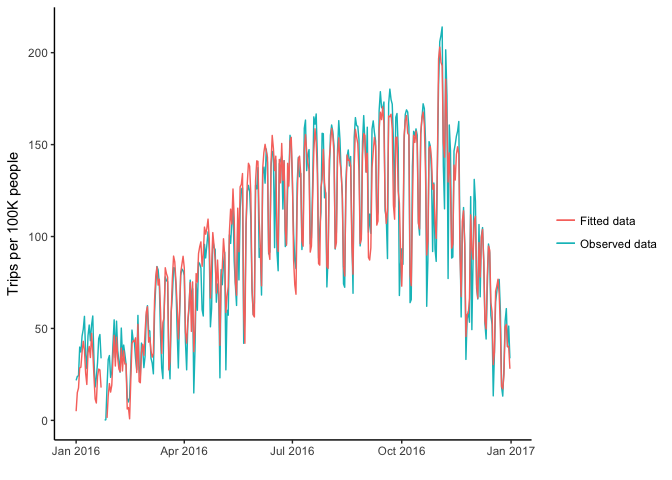<!-- -->

## Model4: Trip rate_shortterm as the outcome

```r
trip_Philly_short <- arrange(dplyr::select(filter(member_data, city == "Philly" & 
    membertype == "shortterm"), by10000, dummy, start_time), start_time)  ##Four-day data missing 01-23 and 01-26
trip_Boston_short <- arrange(dplyr::select(filter(member_data, city == "Boston" & 
    membertype == "shortterm"), by10000, start_time), start_time)
trip_Washington_short <- arrange(dplyr::select(filter(member_data, city == "Washington" & 
    membertype == "shortterm"), by10000, start_time), start_time)  ##Four-day data missing: 01-23 ~ 01-26
trip_Chicago_short <- arrange(dplyr::select(filter(member_data, city == "Chicago" & 
    membertype == "shortterm"), by10000, start_time), start_time)

time_short <- 1:366

## Fill in the missing data
trip_Philly_short[363, "start_time"] <- "2016-01-23"
trip_Philly_short[364, "start_time"] <- "2016-01-24"
trip_Philly_short[365, "start_time"] <- "2016-01-25"
trip_Philly_short[366, "start_time"] <- "2016-01-26"
trip_Philly_short <- arrange(trip_Philly_short, start_time)

trip_Washington_short[363, "start_time"] <- "2016-01-23"
trip_Washington_short[364, "start_time"] <- "2016-01-24"
trip_Washington_short[365, "start_time"] <- "2016-01-25"
trip_Washington_short[366, "start_time"] <- "2016-01-26"
trip_Washington_short <- arrange(trip_Washington_short, start_time)

Philly_short <- trip_Philly_short$by10000 * 10
Boston_short <- trip_Boston_short$by10000 * 10
Washington_short <- trip_Washington_short$by10000 * 10
Chicago_short <- trip_Chicago_short$by10000 * 10

## Model 4.1
lm_tripRate_short <- lm(Philly_short ~ phil_temp16$MEAN + phil_temp16$PRCP + 
    trip_Philly_short$dummy + Boston_short + Washington_short + Chicago_short + 
    time_short + time_short * trip_Philly_short$dummy)

summary(lm_tripRate_short)
```

```
## 
## Call:
## lm(formula = Philly_short ~ phil_temp16$MEAN + phil_temp16$PRCP + 
##     trip_Philly_short$dummy + Boston_short + Washington_short + 
##     Chicago_short + time_short + time_short * trip_Philly_short$dummy)
## 
## Residuals:
##    Min     1Q Median     3Q    Max 
## -23.29  -3.00  -0.91   2.23  36.66 
## 
## Coefficients:
##                                     Estimate Std. Error t value Pr(>|t|)
## (Intercept)                          1.76581    1.59594    1.11    0.269
## phil_temp16$MEAN                     0.05643    0.03633    1.55    0.121
## phil_temp16$PRCP                    -0.77981    0.88054   -0.89    0.376
## trip_Philly_short$dummy            121.67557   17.47457    6.96  1.6e-11
## Boston_short                         0.03154    0.00715    4.41  1.4e-05
## Washington_short                     0.03806    0.00295   12.90  < 2e-16
## Chicago_short                        0.03107    0.00711    4.37  1.6e-05
## time_short                          -0.01610    0.00645   -2.50    0.013
## trip_Philly_short$dummy:time_short  -0.34192    0.05308   -6.44  3.9e-10
##                                       
## (Intercept)                           
## phil_temp16$MEAN                      
## phil_temp16$PRCP                      
## trip_Philly_short$dummy            ***
## Boston_short                       ***
## Washington_short                   ***
## Chicago_short                      ***
## time_short                         *  
## trip_Philly_short$dummy:time_short ***
## ---
## Signif. codes:  0 '***' 0.001 '**' 0.01 '*' 0.05 '.' 0.1 ' ' 1
## 
## Residual standard error: 6.93 on 353 degrees of freedom
##   (4 observations deleted due to missingness)
## Multiple R-squared:  0.808,	Adjusted R-squared:  0.804 
## F-statistic:  186 on 8 and 353 DF,  p-value: <2e-16
```

```r
table3_3 <- cbind(lm_tripRate_short$coefficients, confint(lm_tripRate_short))
table3_3
```

```
##                                                 2.5 %    97.5 %
## (Intercept)                          1.76581 -1.37294   4.90455
## phil_temp16$MEAN                     0.05643 -0.01502   0.12788
## phil_temp16$PRCP                    -0.77981 -2.51157   0.95195
## trip_Philly_short$dummy            121.67557 87.30822 156.04293
## Boston_short                         0.03154  0.01748   0.04560
## Washington_short                     0.03806  0.03226   0.04387
## Chicago_short                        0.03107  0.01709   0.04505
## time_short                          -0.01610 -0.02878  -0.00342
## trip_Philly_short$dummy:time_short  -0.34192 -0.44631  -0.23754
```

```r
tripPhilly_fitted_short <- lm_tripRate_short$fitted.values
fitted_all_short <- vector(length = 366)
fitted_all_short[1:22] <- tripPhilly_fitted_short[1:22]
fitted_all_short[23:26] <- NA
fitted_all_short[27:366] <- tripPhilly_fitted_short[23:362]

lm_plot_short <- ggplot(trip_Philly_short) + geom_line(aes(x = start_time, y = Philly_short, 
    colour = "Observed data")) + geom_line(aes(x = start_time, y = fitted_all_short, 
    colour = "Fitted data")) + theme_classic() + xlab("") + ylab("Trips per 100K people") + 
    scale_colour_discrete(name = "")

plot(lm_plot_short)
```

<!-- -->

```r
## Model 4.2: Three time-periods: pre-strike, strike, post-strike
lm_tripRate_short2 <- lm(Philly_short ~ phil_temp16$MEAN + phil_temp16$PRCP + 
    category + Boston_short + Washington_short + Chicago_short + time_short + 
    time_strike + time_post)
summary(lm_tripRate_short2)
```

```
## 
## Call:
## lm(formula = Philly_short ~ phil_temp16$MEAN + phil_temp16$PRCP + 
##     category + Boston_short + Washington_short + Chicago_short + 
##     time_short + time_strike + time_post)
## 
## Residuals:
##    Min     1Q Median     3Q    Max 
## -22.69  -2.71  -0.70   1.99  36.85 
## 
## Coefficients:
##                  Estimate Std. Error t value Pr(>|t|)    
## (Intercept)       1.66434    1.38683    1.20   0.2309    
## phil_temp16$MEAN  0.05572    0.03157    1.77   0.0784 .  
## phil_temp16$PRCP -0.52109    0.76558   -0.68   0.4965    
## category2        49.26597    5.20524    9.46  < 2e-16 ***
## category3         3.96768    2.01690    1.97   0.0499 *  
## Boston_short      0.03452    0.00623    5.54  5.8e-08 ***
## Washington_short  0.03868    0.00257   15.08  < 2e-16 ***
## Chicago_short     0.02562    0.00621    4.12  4.6e-05 ***
## time_short       -0.01540    0.00560   -2.75   0.0063 ** 
## time_strike      -3.73933    1.14088   -3.28   0.0012 ** 
## time_post        -0.03625    0.05447   -0.67   0.5061    
## ---
## Signif. codes:  0 '***' 0.001 '**' 0.01 '*' 0.05 '.' 0.1 ' ' 1
## 
## Residual standard error: 6.02 on 351 degrees of freedom
##   (4 observations deleted due to missingness)
## Multiple R-squared:  0.856,	Adjusted R-squared:  0.852 
## F-statistic:  209 on 10 and 351 DF,  p-value: <2e-16
```

```r
coef_diff_short <- lm_tripRate_short2$coefficients[4] - lm_tripRate_short2$coefficients[5]
coef_diff_short
```

```
## category2 
##      45.3
```

```r
t_short <- glht(lm_tripRate_short2, K_matrix)
summary(t_short)
```

```
## 
## 	 Simultaneous Tests for General Linear Hypotheses
## 
## Fit: lm(formula = Philly_short ~ phil_temp16$MEAN + phil_temp16$PRCP + 
##     category + Boston_short + Washington_short + Chicago_short + 
##     time_short + time_strike + time_post)
## 
## Linear Hypotheses:
##        Estimate Std. Error t value Pr(>|t|)    
## 1 == 0   -45.30       5.36   -8.46  7.8e-16 ***
## ---
## Signif. codes:  0 '***' 0.001 '**' 0.01 '*' 0.05 '.' 0.1 ' ' 1
## (Adjusted p values reported -- single-step method)
```

```r
confint(t_short)
```

```
## 
## 	 Simultaneous Confidence Intervals
## 
## Fit: lm(formula = Philly_short ~ phil_temp16$MEAN + phil_temp16$PRCP + 
##     category + Boston_short + Washington_short + Chicago_short + 
##     time_short + time_strike + time_post)
## 
## Quantile = 1.967
## 95% family-wise confidence level
##  
## 
## Linear Hypotheses:
##        Estimate lwr     upr    
## 1 == 0 -45.298  -55.831 -34.766
```

```r
table3_6 <- cbind(lm_tripRate_short2$coefficients, confint(lm_tripRate_short2))

table3_6
```

```
##                                2.5 %    97.5 %
## (Intercept)       1.66434 -1.0632054  4.391895
## phil_temp16$MEAN  0.05572 -0.0063664  0.117815
## phil_temp16$PRCP -0.52109 -2.0267969  0.984613
## category2        49.26597 39.0285836 59.503358
## category3         3.96768  0.0009442  7.934410
## Boston_short      0.03452  0.0222738  0.046766
## Washington_short  0.03868  0.0336323  0.043723
## Chicago_short     0.02562  0.0134021  0.037836
## time_short       -0.01540 -0.0264239 -0.004377
## time_strike      -3.73933 -5.9831606 -1.495502
## time_post        -0.03625 -0.1433709  0.070869
```

```r
tripPhilly_fitted_short2 <- lm_tripRate_short2$fitted.values
fitted_all_short2 <- vector(length = 366)
fitted_all_short2[1:22] <- tripPhilly_fitted_short2[1:22]
fitted_all_short2[23:26] <- NA
fitted_all_short2[27:366] <- tripPhilly_fitted_short2[23:362]

lm_plot_short2 <- ggplot(trip_Philly_short) + geom_line(aes(x = start_time, 
    y = Philly_short, colour = "Observed data")) + geom_line(aes(x = start_time, 
    y = fitted_all_short2, colour = "Fitted data")) + theme_classic() + xlab("") + 
    ylab("Trips per 100K people") + scale_colour_discrete(name = "")

plot(lm_plot_short2)
```

<!-- -->

###Plot the three figures (all users, members, non-members) from the three models that account for pre-strike, strike, and post-strike periods

```r
## Prepare the dataframe
observed_data <- c(trip_Philly$by100000, Philly_mem, Philly_short)
fitted_data <- c(tripPhilly_fitted3, fitted_all2, fitted_all_short2)
plot_x <- as.Date(rep(trip_Philly$start_time, 6))
plot_y <- c(observed_data, fitted_data)
data_type <- rep(c(rep("All users", 366), rep("Members", 366), rep("Non-members", 
    366)), 2)
type <- c(rep("Observed", 366 * 3), rep("Fitted", 366 * 3))

final_data <- data.frame(plot_x = plot_x, plot_y = plot_y, data_type = data_type, 
    values = type)

ggplot(data = final_data) + aes(x = plot_x, y = plot_y, color = type, group = values) + 
    geom_line() + facet_grid(data_type ~ .) + xlab("") + ylab("Trips per 100K people") + 
    theme_classic()
```

<!-- -->


### Subset to create datasets for each city


```r
## All data
philly_data <- arrange(filter(city_data, city == "Philly"), start_time)
boston_data <- arrange(filter(city_data, city == "Boston"), start_time)
chicago_data <- arrange(filter(city_data, city == "Chicago"), start_time)
washington_data <- arrange(filter(city_data, city == "Washington"), start_time)
```

### Model5: Philly CausalImpact

#### Set pre- and post-periods

```r
## Set pre- and post-periods
pre_period <- as.Date(c("2016-01-01", "2016-10-31"))
post_period <- as.Date(c("2016-11-01", "2016-12-31"))
post_period2 <- as.Date(c("2016-11-01", "2016-11-07"))  ##Assess the impact one week after the strike
post_strike <- as.Date(c("2016-11-08", "2016-12-31"))
```

#### Modelling all Philadelphia data

```r
philly_all <- zoo(cbind(philly_data$by100000, phil_temp16$MEAN, phil_temp16$PRCP, 
    boston_data$by100000, washington_data$by100000, chicago_data$by100000), 
    as.Date(philly_data$start_time))

## Model5.1: Modelling without covaraites
impact_phil <- CausalImpact(data = philly_all[, 1], pre.period = pre_period, 
    post.period = post_period, model.args = list(niter = 5000, nseasons = 7))
summary(impact_phil)
```

```
## Posterior inference {CausalImpact}
## 
##                          Average        Cumulative    
## Actual                   108            6588          
## Prediction (s.d.)        148 (12)       9009 (717)    
## 95% CI                   [124, 170]     [7588, 10394] 
##                                                       
## Absolute effect (s.d.)   -40 (12)       -2421 (717)   
## 95% CI                   [-62, -16]     [-3806, -1000]
##                                                       
## Relative effect (s.d.)   -27% (8%)      -27% (8%)     
## 95% CI                   [-42%, -11%]   [-42%, -11%]  
## 
## Posterior tail-area probability p:   0.00061
## Posterior prob. of a causal effect:  99.93897%
## 
## For more details, type: summary(impact, "report")
```

```r
plot(impact_phil)
```

<!-- -->

```r
## Model5.2:Modelling with covaraites: temperature; precipitation; trip-rate
## in other three cities
impact_phil2 <- CausalImpact(data = philly_all, pre.period = pre_period, post.period = post_period, 
    model.args = list(niter = 5000, nseasons = 7))
summary(impact_phil2, "report")
```

```
## Analysis report {CausalImpact}
## 
## 
## During the post-intervention period, the response variable had an average value of approx. 108.00. In the absence of an intervention, we would have expected an average response of 97.29. The 95% interval of this counterfactual prediction is [86.62, 108.24]. Subtracting this prediction from the observed response yields an estimate of the causal effect the intervention had on the response variable. This effect is 10.71 with a 95% interval of [-0.25, 21.37]. For a discussion of the significance of this effect, see below.
## 
## Summing up the individual data points during the post-intervention period (which can only sometimes be meaningfully interpreted), the response variable had an overall value of 6.59K. Had the intervention not taken place, we would have expected a sum of 5.93K. The 95% interval of this prediction is [5.28K, 6.60K].
## 
## The above results are given in terms of absolute numbers. In relative terms, the response variable showed an increase of +11%. The 95% interval of this percentage is [-0%, +22%].
## 
## This means that, although the intervention appears to have caused a positive effect, this effect is not statistically significant when considering the entire post-intervention period as a whole. Individual days or shorter stretches within the intervention period may of course still have had a significant effect, as indicated whenever the lower limit of the impact time series (lower plot) was above zero. The apparent effect could be the result of random fluctuations that are unrelated to the intervention. This is often the case when the intervention period is very long and includes much of the time when the effect has already worn off. It can also be the case when the intervention period is too short to distinguish the signal from the noise. Finally, failing to find a significant effect can happen when there are not enough control variables or when these variables do not correlate well with the response variable during the learning period.
## 
## The probability of obtaining this effect by chance is very small (Bayesian one-sided tail-area probability p = 0.029). This means the causal effect can be considered statistically significant.
```

```r
plot(impact_phil2, c("original", "pointwise"))
```

<!-- -->

```r
# plot(impact_phil2$model$bsts.model,'coefficients')

## Model5.3:Post-period set as one week after the strike
impact_phil3 <- CausalImpact(data = philly_all, pre.period = pre_period, post.period = post_period2, 
    model.args = list(niter = 5000, nseasons = 7))
summary(impact_phil3, "report")
```

```
## Analysis report {CausalImpact}
## 
## 
## During the post-intervention period, the response variable had an average value of approx. 234.37. By contrast, in the absence of an intervention, we would have expected an average response of 148.90. The 95% interval of this counterfactual prediction is [135.77, 162.32]. Subtracting this prediction from the observed response yields an estimate of the causal effect the intervention had on the response variable. This effect is 85.47 with a 95% interval of [72.05, 98.59]. For a discussion of the significance of this effect, see below.
## 
## Summing up the individual data points during the post-intervention period (which can only sometimes be meaningfully interpreted), the response variable had an overall value of 1.64K. By contrast, had the intervention not taken place, we would have expected a sum of 1.04K. The 95% interval of this prediction is [0.95K, 1.14K].
## 
## The above results are given in terms of absolute numbers. In relative terms, the response variable showed an increase of +57%. The 95% interval of this percentage is [+48%, +66%].
## 
## This means that the positive effect observed during the intervention period is statistically significant and unlikely to be due to random fluctuations. It should be noted, however, that the question of whether this increase also bears substantive significance can only be answered by comparing the absolute effect (85.47) to the original goal of the underlying intervention.
## 
## The probability of obtaining this effect by chance is very small (Bayesian one-sided tail-area probability p = 0). This means the causal effect can be considered statistically significant.
```

```r
plot(impact_phil3, c("original", "pointwise"))
```

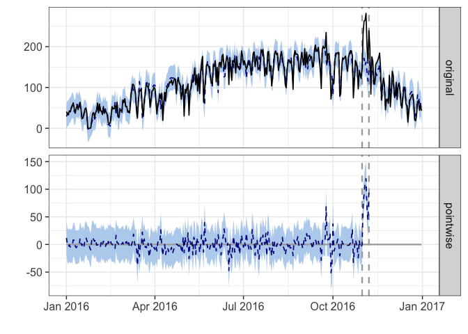<!-- -->

```r
## Model5.4:Pre-period: strike
impact_phil4 <- CausalImpact(data = philly_all, pre.period = post_period2, post.period = post_strike, 
    model.args = list(niter = 5000, nseasons = 7))
summary(impact_phil4, "report")
```

```
## Analysis report {CausalImpact}
## 
## 
## During the post-intervention period, the response variable had an average value of approx. 91.62. In the absence of an intervention, we would have expected an average response of 147.59. The 95% interval of this counterfactual prediction is [-90.36, 359.32]. Subtracting this prediction from the observed response yields an estimate of the causal effect the intervention had on the response variable. This effect is -55.98 with a 95% interval of [-267.70, 181.98]. For a discussion of the significance of this effect, see below.
## 
## Summing up the individual data points during the post-intervention period (which can only sometimes be meaningfully interpreted), the response variable had an overall value of 4.95K. Had the intervention not taken place, we would have expected a sum of 7.97K. The 95% interval of this prediction is [-4.88K, 19.40K].
## 
## The above results are given in terms of absolute numbers. In relative terms, the response variable showed a decrease of-38%. The 95% interval of this percentage is [-181%, +123%].
## 
## This means that, although it may look as though the intervention has exerted a negative effect on the response variable when considering the intervention period as a whole, this effect is not statistically significant, and so cannot be meaningfully interpreted. The apparent effect could be the result of random fluctuations that are unrelated to the intervention. This is often the case when the intervention period is very long and includes much of the time when the effect has already worn off. It can also be the case when the intervention period is too short to distinguish the signal from the noise. Finally, failing to find a significant effect can happen when there are not enough control variables or when these variables do not correlate well with the response variable during the learning period.
## 
## The probability of obtaining this effect by chance is p = 0.287. This means the effect may be spurious and would generally not be considered statistically significant.
```

```r
plot(impact_phil4, c("original", "pointwise"))
```

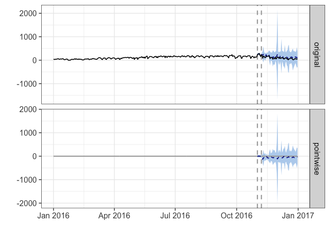<!-- -->

```r
# ##Dynamic regression: whether to include a time-varying regression
# coefficient. Default is FALSE impact_phil4 <- CausalImpact(data = data,
# pre.period = pre.period, post.period = post.period, model.args =
# list(niter=5000, nseasons=7, dynamic.regression=T)) ##Control monthly
# effect impact_phil5 <- CausalImpact(data = data, pre.period = pre.period,
# post.period = post.period, model.args = list(niter=5000, nseasons=12,
# season.duration= 30)) ##Control seasonal effect impact_phil6 <-
# CausalImpact(data = data, pre.period = pre.period, post.period =
# post.period, model.args = list(niter=5000, nseasons=4))

# plot(impact_phil4) ##Not a good fit!!!  plot(impact_phil5) ##Not a good
# fit!!!  plot(impact_phil6) ##Not a good fit!!!
```


#### Modelling Philadelphia data_membership

```r
## CausalImpact does not support missing covariaets: Impute missing trip data
## with weekly moving average
Washington_mem[23:26] <- trip_Washington_MA$cnt_ma7[23:26]

philly_mem_ci <- zoo(cbind(Philly_mem, MEAN = phil_temp16$MEAN, PRCP = phil_temp16$PRCP, 
    Boston_mem, Washington_mem, Chicago_mem), as.Date(philly_data$start_time))

## Model5.5
impact_phil_mem <- CausalImpact(data = philly_mem_ci, pre.period = pre_period, 
    post.period = post_period, model.args = list(niter = 5000, nseasons = 7))
summary(impact_phil_mem)
```

```
## Posterior inference {CausalImpact}
## 
##                          Average        Cumulative     
## Actual                   94             5720           
## Prediction (s.d.)        93 (4.8)       5693 (295.3)   
## 95% CI                   [84, 103]      [5124, 6281]   
##                                                        
## Absolute effect (s.d.)   0.45 (4.8)     27.40 (295.3)  
## 95% CI                   [-9.2, 9.8]    [-561.3, 595.7]
##                                                        
## Relative effect (s.d.)   0.48% (5.2%)   0.48% (5.2%)   
## 95% CI                   [-9.9%, 10%]   [-9.9%, 10%]   
## 
## Posterior tail-area probability p:   0.46695
## Posterior prob. of a causal effect:  53%
## 
## For more details, type: summary(impact, "report")
```

```r
plot(impact_phil_mem, c("original", "pointwise"))
```

<!-- -->

```r
## Model5.6:Post-period set as one week after the strike
impact_phil_mem2 <- CausalImpact(data = philly_mem_ci, pre.period = pre_period, 
    post.period = post_period2, model.args = list(niter = 5000, nseasons = 7))
summary(impact_phil_mem2, "report")
```

```
## Analysis report {CausalImpact}
## 
## 
## During the post-intervention period, the response variable had an average value of approx. 181.01. By contrast, in the absence of an intervention, we would have expected an average response of 131.82. The 95% interval of this counterfactual prediction is [121.34, 142.85]. Subtracting this prediction from the observed response yields an estimate of the causal effect the intervention had on the response variable. This effect is 49.19 with a 95% interval of [38.16, 59.67]. For a discussion of the significance of this effect, see below.
## 
## Summing up the individual data points during the post-intervention period (which can only sometimes be meaningfully interpreted), the response variable had an overall value of 1.27K. By contrast, had the intervention not taken place, we would have expected a sum of 0.92K. The 95% interval of this prediction is [0.85K, 1.00K].
## 
## The above results are given in terms of absolute numbers. In relative terms, the response variable showed an increase of +37%. The 95% interval of this percentage is [+29%, +45%].
## 
## This means that the positive effect observed during the intervention period is statistically significant and unlikely to be due to random fluctuations. It should be noted, however, that the question of whether this increase also bears substantive significance can only be answered by comparing the absolute effect (49.19) to the original goal of the underlying intervention.
## 
## The probability of obtaining this effect by chance is very small (Bayesian one-sided tail-area probability p = 0). This means the causal effect can be considered statistically significant.
```

```r
plot(impact_phil_mem2, c("original", "pointwise"))
```

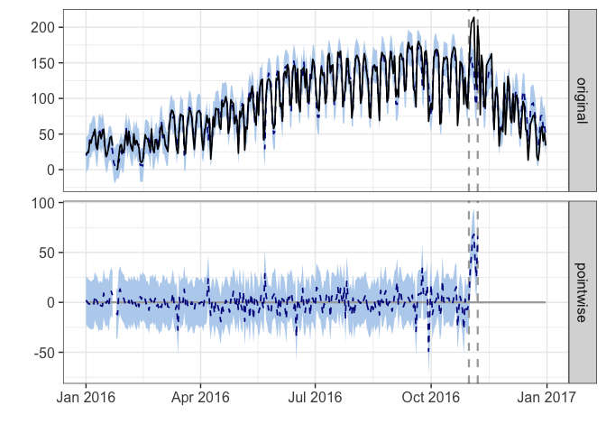<!-- -->

```r
## Model5.7:Pre-period: strike
impact_phil_mem3 <- CausalImpact(data = philly_mem_ci, pre.period = post_period2, 
    post.period = post_strike, model.args = list(niter = 5000, nseasons = 7))
summary(impact_phil_mem3, "report")
```

```
## Analysis report {CausalImpact}
## 
## 
## During the post-intervention period, the response variable had an average value of approx. 82.46. In the absence of an intervention, we would have expected an average response of 122.17. The 95% interval of this counterfactual prediction is [-20.22, 253.37]. Subtracting this prediction from the observed response yields an estimate of the causal effect the intervention had on the response variable. This effect is -39.71 with a 95% interval of [-170.91, 102.68]. For a discussion of the significance of this effect, see below.
## 
## Summing up the individual data points during the post-intervention period (which can only sometimes be meaningfully interpreted), the response variable had an overall value of 4.45K. Had the intervention not taken place, we would have expected a sum of 6.60K. The 95% interval of this prediction is [-1.09K, 13.68K].
## 
## The above results are given in terms of absolute numbers. In relative terms, the response variable showed a decrease of-33%. The 95% interval of this percentage is [-140%, +84%].
## 
## This means that, although it may look as though the intervention has exerted a negative effect on the response variable when considering the intervention period as a whole, this effect is not statistically significant, and so cannot be meaningfully interpreted. The apparent effect could be the result of random fluctuations that are unrelated to the intervention. This is often the case when the intervention period is very long and includes much of the time when the effect has already worn off. It can also be the case when the intervention period is too short to distinguish the signal from the noise. Finally, failing to find a significant effect can happen when there are not enough control variables or when these variables do not correlate well with the response variable during the learning period.
## 
## The probability of obtaining this effect by chance is p = 0.258. This means the effect may be spurious and would generally not be considered statistically significant.
```

```r
plot(impact_phil_mem3, c("original", "pointwise"))
```

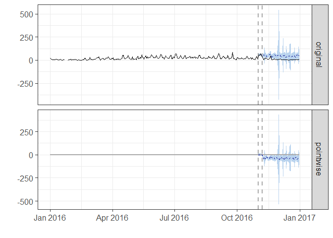<!-- -->

#### Modelling Philadelphia data_shortterm

```r
## CausalImpact does not support missing covariaets: Impute missing trip data
## with weekly moving average
Washington_short[23:26] <- trip_Washington_MA$cnt_ma7[23:26]

philly_short_ci <- zoo(cbind(Philly_short, MEAN = phil_temp16$MEAN, PRCP = phil_temp16$PRCP, 
    Boston_short, Washington_short, Chicago_short), as.Date(philly_data$start_time))

## Model5.8
impact_phil_short <- CausalImpact(data = philly_short_ci, pre.period = pre_period, 
    post.period = post_period, model.args = list(niter = 5000, nseasons = 7))
summary(impact_phil_short)
```

```
## Posterior inference {CausalImpact}
## 
##                          Average       Cumulative    
## Actual                   14            868           
## Prediction (s.d.)        9.9 (1.7)     605.8 (104.4) 
## 95% CI                   [6.7, 13]     [405.7, 812]  
##                                                      
## Absolute effect (s.d.)   4.3 (1.7)     262.1 (104.4) 
## 95% CI                   [0.91, 7.6]   [55.69, 462.2]
##                                                      
## Relative effect (s.d.)   43% (17%)     43% (17%)     
## 95% CI                   [9.2%, 76%]   [9.2%, 76%]   
## 
## Posterior tail-area probability p:   0.0061
## Posterior prob. of a causal effect:  99.39037%
## 
## For more details, type: summary(impact, "report")
```

```r
plot(impact_phil_short, c("original", "pointwise"))
```

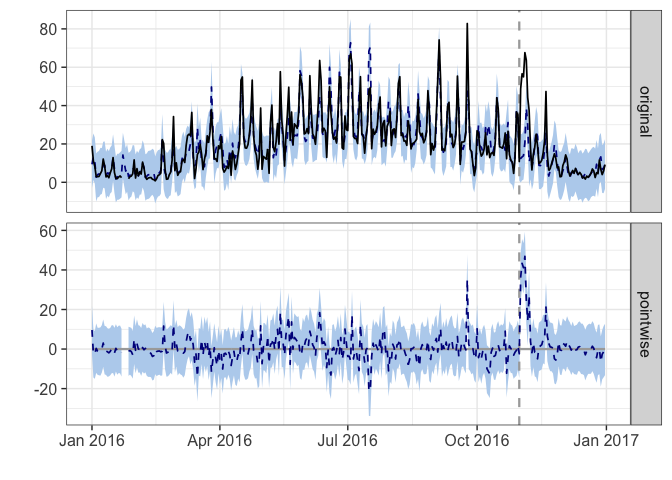<!-- -->

```r
## Model5.9:Post-period set as one week after the strike
impact_phil_short2 <- CausalImpact(data = philly_short_ci, pre.period = pre_period, 
    post.period = post_period2, model.args = list(niter = 5000, nseasons = 7))
summary(impact_phil_short2, "report")
```

```
## Analysis report {CausalImpact}
## 
## 
## During the post-intervention period, the response variable had an average value of approx. 53.36. By contrast, in the absence of an intervention, we would have expected an average response of 19.87. The 95% interval of this counterfactual prediction is [14.80, 25.10]. Subtracting this prediction from the observed response yields an estimate of the causal effect the intervention had on the response variable. This effect is 33.48 with a 95% interval of [28.26, 38.56]. For a discussion of the significance of this effect, see below.
## 
## Summing up the individual data points during the post-intervention period (which can only sometimes be meaningfully interpreted), the response variable had an overall value of 373.50. By contrast, had the intervention not taken place, we would have expected a sum of 139.12. The 95% interval of this prediction is [103.57, 175.67].
## 
## The above results are given in terms of absolute numbers. In relative terms, the response variable showed an increase of +168%. The 95% interval of this percentage is [+142%, +194%].
## 
## This means that the positive effect observed during the intervention period is statistically significant and unlikely to be due to random fluctuations. It should be noted, however, that the question of whether this increase also bears substantive significance can only be answered by comparing the absolute effect (33.48) to the original goal of the underlying intervention.
## 
## The probability of obtaining this effect by chance is very small (Bayesian one-sided tail-area probability p = 0). This means the causal effect can be considered statistically significant.
```

```r
plot(impact_phil_short2, c("original", "pointwise"))
```

<!-- -->

```r
## Model5.10:Pre-period: strike
impact_phil_short3 <- CausalImpact(data = philly_short_ci, pre.period = post_period2, 
    post.period = post_strike, model.args = list(niter = 5000, nseasons = 7))
summary(impact_phil_short3, "report")
```

```
## Analysis report {CausalImpact}
## 
## 
## During the post-intervention period, the response variable had an average value of approx. 9.16. By contrast, in the absence of an intervention, we would have expected an average response of 47.24. The 95% interval of this counterfactual prediction is [12.61, 80.17]. Subtracting this prediction from the observed response yields an estimate of the causal effect the intervention had on the response variable. This effect is -38.08 with a 95% interval of [-71.02, -3.46]. For a discussion of the significance of this effect, see below.
## 
## Summing up the individual data points during the post-intervention period (which can only sometimes be meaningfully interpreted), the response variable had an overall value of 494.43. By contrast, had the intervention not taken place, we would have expected a sum of 2550.98. The 95% interval of this prediction is [681.02, 4329.38].
## 
## The above results are given in terms of absolute numbers. In relative terms, the response variable showed a decrease of-81%. The 95% interval of this percentage is [-150%, -7%].
## 
## This means that the negative effect observed during the intervention period is statistically significant. If the experimenter had expected a positive effect, it is recommended to double-check whether anomalies in the control variables may have caused an overly optimistic expectation of what should have happened in the response variable in the absence of the intervention.
## 
## The probability of obtaining this effect by chance is very small (Bayesian one-sided tail-area probability p = 0.019). This means the causal effect can be considered statistically significant.
```

```r
plot(impact_phil_short3, c("original", "pointwise"))
```

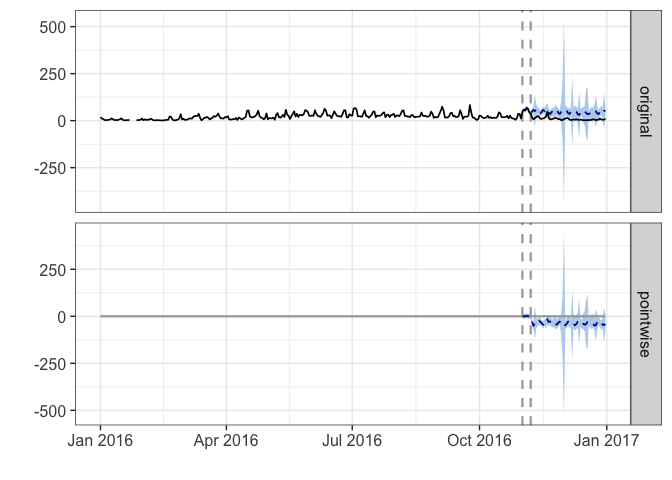<!-- -->

## Boston data analysis

```r
boston_data <- zoo(cbind(boston_data$by100000), as.Date(boston_data$start_time))

impact_bos <- CausalImpact(data = boston_data, pre.period = pre_period, post.period = post_period, 
    model.args = list(niter = 5000, nseasons = 7))
summary(impact_bos)
```

```
## Posterior inference {CausalImpact}
## 
##                          Average        Cumulative     
## Actual                   356            21719          
## Prediction (s.d.)        619 (81)       37763 (4915)   
## 95% CI                   [458, 773]     [27929, 47124] 
##                                                        
## Absolute effect (s.d.)   -263 (81)      -16044 (4915)  
## 95% CI                   [-416, -102]   [-25405, -6210]
##                                                        
## Relative effect (s.d.)   -42% (13%)     -42% (13%)     
## 95% CI                   [-67%, -16%]   [-67%, -16%]   
## 
## Posterior tail-area probability p:   0.00105
## Posterior prob. of a causal effect:  99.89485%
## 
## For more details, type: summary(impact, "report")
```

```r
plot(impact_bos)
```

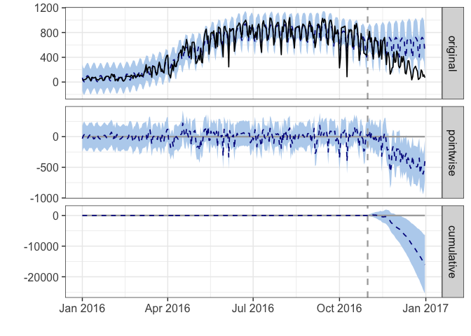<!-- -->

## Chicago data anlysis 

```r
chicago_data <- zoo(cbind(chicago_data$by100000), as.Date(chicago_data$start_time))

impact_chi <- CausalImpact(data = chicago_data, pre.period = pre_period, post.period = post_period, 
    model.args = list(niter = 5000, nseasons = 7))
summary(impact_chi)
```

```
## Posterior inference {CausalImpact}
## 
##                          Average        Cumulative     
## Actual                   203            12377          
## Prediction (s.d.)        401 (53)       24465 (3208)   
## 95% CI                   [297, 502]     [18129, 30603] 
##                                                        
## Absolute effect (s.d.)   -198 (53)      -12088 (3208)  
## 95% CI                   [-299, -94]    [-18226, -5752]
##                                                        
## Relative effect (s.d.)   -49% (13%)     -49% (13%)     
## 95% CI                   [-74%, -24%]   [-74%, -24%]   
## 
## Posterior tail-area probability p:   0.00061
## Posterior prob. of a causal effect:  99.93906%
## 
## For more details, type: summary(impact, "report")
```

```r
plot(impact_chi)  ##Not a good fit to the data
```

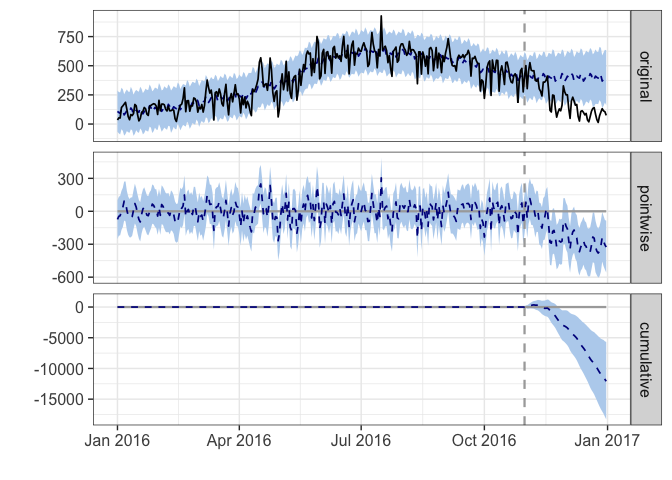<!-- -->

## Washington data anlysis 

```r
washington_data <- zoo(cbind(washington_data$by100000), as.Date(washington_data$start_time))

impact_DC <- CausalImpact(data = washington_data, pre.period = pre_period, post.period = post_period, 
    model.args = list(niter = 5000, nseasons = 7))
summary(impact_DC)
```

```
## Posterior inference {CausalImpact}
## 
##                          Average        Cumulative      
## Actual                   1043           63643           
## Prediction (s.d.)        1651 (136)     100700 (8290)   
## 95% CI                   [1387, 1914]   [84610, 116774] 
##                                                         
## Absolute effect (s.d.)   -607 (136)     -37057 (8290)   
## 95% CI                   [-871, -344]   [-53131, -20967]
##                                                         
## Relative effect (s.d.)   -37% (8.2%)    -37% (8.2%)     
## 95% CI                   [-53%, -21%]   [-53%, -21%]    
## 
## Posterior tail-area probability p:   0.00041
## Posterior prob. of a causal effect:  99.9592%
## 
## For more details, type: summary(impact, "report")
```

```r
plot(impact_DC)  ##Not a good fit to the data
```

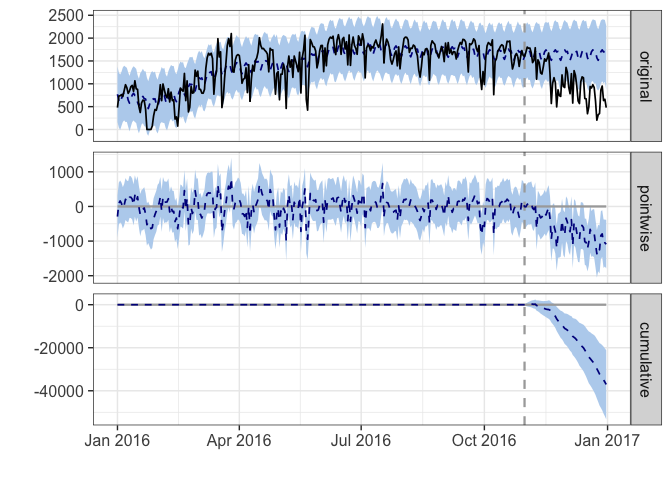<!-- -->


