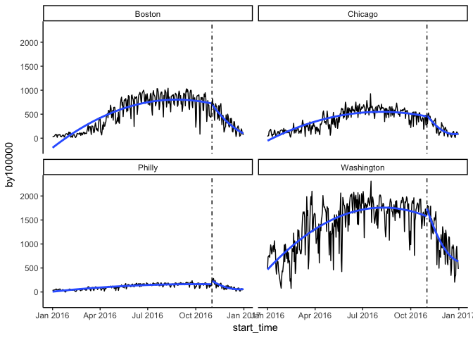

# Philly Bikeshare Analysis
Daniel Fuller  
September 1, 2017  


```r
library(stringr)
library(knitr)
library(dplyr)
```

```
## 
## Attaching package: 'dplyr'
```

```
## The following objects are masked from 'package:stats':
## 
##     filter, lag
```

```
## The following objects are masked from 'package:base':
## 
##     intersect, setdiff, setequal, union
```

```r
library(lubridate)
```

```
## 
## Attaching package: 'lubridate'
```

```
## The following object is masked from 'package:base':
## 
##     date
```

```r
library(ggplot2)
library(ggplot2)
library(forecast)
library(tseries)
library(formatR)

options(scipen = 2, digits=4)
opts_chunk$set(warning = FALSE, message = FALSE, error = FALSE, tidy = TRUE)
```


```r
city_data <- read.csv("https://raw.githubusercontent.com/walkabilly/Phillybikeshare/master/CityColl.csv")

### Convert start_time from factor to date
city_data$start_time <- mdy(city_data$start_time)
```

### Time Series Plot 

#### All bikeshare users (members and non-members)


```r
cityplot <- ggplot(data = city_data, aes(x = start_time, y = by100000)) + geom_line() + 
    stat_smooth(aes(group = dummy), method = "lm", formula = y ~ poly(x, 2), 
        se = FALSE) + geom_vline(xintercept = as.numeric(city_data$start_time[1398]), 
    linetype = 4) + facet_wrap(~city) + theme_classic()


plot(cityplot)
```

<!-- -->

#### Bikeshare members only


### Linear Model


```r
lm2citycoll <- lm(number_trips ~ start_time + dummy + start_time * dummy, data = city_data)
summary(lm2citycoll)
```

```
## 
## Call:
## lm(formula = number_trips ~ start_time + dummy + start_time * 
##     dummy, data = city_data)
## 
## Residuals:
##    Min     1Q Median     3Q    Max 
##  -9028  -3341  -1047   3174  17470 
## 
## Coefficients:
##                    Estimate Std. Error t value Pr(>|t|)    
## (Intercept)      -408243.39   24399.45  -16.73  < 2e-16 ***
## start_time            24.46       1.44   17.00  < 2e-16 ***
## dummy            2163915.42  275380.50    7.86  7.5e-15 ***
## start_time:dummy    -126.67      16.07   -7.88  6.3e-15 ***
## ---
## Signif. codes:  0 '***' 0.001 '**' 0.01 '*' 0.05 '.' 0.1 ' ' 1
## 
## Residual standard error: 4400 on 1454 degrees of freedom
## Multiple R-squared:  0.209,	Adjusted R-squared:  0.208 
## F-statistic:  128 on 3 and 1454 DF,  p-value: <2e-16
```

```r
lm3citycoll <- lm(number_trips ~ start_time + dummy + city + start_time * dummy + 
    city * dummy, data = city_data)
summary(lm3citycoll)
```

```
## 
## Call:
## lm(formula = number_trips ~ start_time + dummy + city + start_time * 
##     dummy + city * dummy, data = city_data)
## 
## Residuals:
##    Min     1Q Median     3Q    Max 
##  -9407  -1305     58   1381  13196 
## 
## Coefficients:
##                         Estimate  Std. Error t value Pr(>|t|)    
## (Intercept)          -410276.117   14153.789  -28.99   <2e-16 ***
## start_time                24.412       0.835   29.24   <2e-16 ***
## dummy                2164185.607  159739.219   13.55   <2e-16 ***
## cityChicago             7116.207     206.790   34.41   <2e-16 ***
## cityPhilly             -1777.886     207.133   -8.58   <2e-16 ***
## cityWashington          6034.629     207.481   29.09   <2e-16 ***
## start_time:dummy        -126.626       9.323  -13.58   <2e-16 ***
## dummy:cityChicago      -4022.092     506.531   -7.94    4e-15 ***
## dummy:cityPhilly        1095.788     506.671    2.16   0.0307 *  
## dummy:cityWashington   -1396.466     506.813   -2.76   0.0059 ** 
## ---
## Signif. codes:  0 '***' 0.001 '**' 0.01 '*' 0.05 '.' 0.1 ' ' 1
## 
## Residual standard error: 2550 on 1448 degrees of freedom
## Multiple R-squared:  0.735,	Adjusted R-squared:  0.733 
## F-statistic:  446 on 9 and 1448 DF,  p-value: <2e-16
```

```r
lm2by100k <- lm(by100000 ~ start_time + dummy + start_time * dummy, data = city_data)
summary(lm2by100k)
```

```
## 
## Call:
## lm(formula = by100000 ~ start_time + dummy + start_time * dummy, 
##     data = city_data)
## 
## Residuals:
##    Min     1Q Median     3Q    Max 
##   -863   -344   -174    213   1631 
## 
## Coefficients:
##                    Estimate Std. Error t value Pr(>|t|)    
## (Intercept)      -37205.213   2935.571  -12.67  < 2e-16 ***
## start_time            2.231      0.173   12.89  < 2e-16 ***
## dummy            198986.846  33131.855    6.01  2.4e-09 ***
## start_time:dummy    -11.647      1.934   -6.02  2.2e-09 ***
## ---
## Signif. codes:  0 '***' 0.001 '**' 0.01 '*' 0.05 '.' 0.1 ' ' 1
## 
## Residual standard error: 530 on 1454 degrees of freedom
## Multiple R-squared:  0.13,	Adjusted R-squared:  0.128 
## F-statistic: 72.2 on 3 and 1454 DF,  p-value: <2e-16
```

```r
lm3by100k <- lm(by100000 ~ start_time + dummy + city + start_time * dummy + 
    city * dummy, data = city_data)
summary(lm3by100k)
```

```
## 
## Call:
## lm(formula = by100000 ~ start_time + dummy + city + start_time * 
##     dummy + city * dummy, data = city_data)
## 
## Residuals:
##    Min     1Q Median     3Q    Max 
##  -1122   -140     18    148    815 
## 
## Coefficients:
##                         Estimate  Std. Error t value Pr(>|t|)    
## (Intercept)          -36765.0469   1316.3165  -27.93  < 2e-16 ***
## start_time                2.2003      0.0776   28.34  < 2e-16 ***
## dummy                198475.1636  14855.9065   13.36  < 2e-16 ***
## cityChicago            -139.5975     19.2317   -7.26  6.4e-13 ***
## cityPhilly             -422.0623     19.2635  -21.91  < 2e-16 ***
## cityWashington          896.0880     19.2960   46.44  < 2e-16 ***
## start_time:dummy        -11.6164      0.8670  -13.40  < 2e-16 ***
## dummy:cityChicago       -13.5514     47.1079   -0.29  0.77364    
## dummy:cityPhilly        174.0069     47.1209    3.69  0.00023 ***
## dummy:cityWashington   -208.8156     47.1342   -4.43  1.0e-05 ***
## ---
## Signif. codes:  0 '***' 0.001 '**' 0.01 '*' 0.05 '.' 0.1 ' ' 1
## 
## Residual standard error: 237 on 1448 degrees of freedom
## Multiple R-squared:  0.826,	Adjusted R-squared:  0.825 
## F-statistic:  762 on 9 and 1448 DF,  p-value: <2e-16
```

```
##Boston Moving Average

bostoncoll$Date = as.Date(bostoncoll$start_time)

ggplot(bostoncoll, aes(Date, by100000)) +
  geom_line() +
  scale_x_date('month') +
  ylab("Number of Trips") +
  xlab("")

##Data clean, smoothing outliers

bostoncount_ts = ts(bostoncoll[, c('by100000')])

bostoncoll$clean_cnt = tsclean(as.vector(bostoncount_ts))

ggplot() +
  geom_line(data = bostoncoll, aes(x = Date, y = clean_cnt)) +
  ylab('Cleaned Number of Trips')

#using the clean count with no outliers

bostoncoll$cnt_ma = ma(bostoncoll$clean_cnt, order=7) 

bostoncoll$cnt_ma30 = ma(bostoncoll$clean_cnt, order=30)

ggplot() +
  geom_line(data = bostoncoll, aes(x = Date, y = clean_cnt, colour = "Counts")) +
  geom_line(data = bostoncoll, aes(x = Date, y = cnt_ma,   colour = "Weekly Moving Average"))  +
  geom_line(data = bostoncoll, aes(x = Date, y = cnt_ma30, colour = "Monthly Moving Average"))  +
  ylab('Number of Trips x 100000 person')

##Chicago Moving Average

chicagocoll$Date = as.Date(chicagocoll$start_time)

ggplot(chicagocoll, aes(Date, by100000)) +
  geom_line() +
  scale_x_date('month') +
  ylab("Number of Trips") +
  xlab("")

##Data clean, smoothing outliers

chicagocount_ts = ts(chicagocoll[, c('by100000')])

chicagocoll$clean_cnt = tsclean(as.vector(chicagocount_ts))

ggplot() +
  geom_line(data = chicagocoll, aes(x = Date, y = clean_cnt)) +
  ylab('Cleaned Number of Trips')

#using the clean count with no outliers

chicagocoll$cnt_ma = ma(chicagocoll$clean_cnt, order=7) 

chicagocoll$cnt_ma30 = ma(chicagocoll$clean_cnt, order=30)

ggplot() +
  geom_line(data = chicagocoll, aes(x = Date, y = clean_cnt, colour = "Counts")) +
  geom_line(data = chicagocoll, aes(x = Date, y = cnt_ma,   colour = "Weekly Moving Average"))  +
  geom_line(data = chicagocoll, aes(x = Date, y = cnt_ma30, colour = "Monthly Moving Average"))  +
  ylab('Number of Trips x 100000 person')

##Washington moving average

washingtoncoll$Date = as.Date(washingtoncoll$start_time)

ggplot(washingtoncoll, aes(Date, by100000)) +
  geom_line() +
  scale_x_date('month') +
  ylab("Number of Trips") +
  xlab("")

##Data clean, smoothing outliers

washcount_ts = ts(washingtoncoll[, c('by100000')])

washingtoncoll$clean_cnt = tsclean(as.vector(washcount_ts))

ggplot() +
  geom_line(data = washingtoncoll, aes(x = Date, y = clean_cnt)) +
  ylab('Cleaned Number of Trips')

#using the clean count with no outliers

washingtoncoll$cnt_ma = ma(washingtoncoll$clean_cnt, order=7) 

washingtoncoll$cnt_ma30 = ma(washingtoncoll$clean_cnt, order=30)

ggplot() +
  geom_line(data = washingtoncoll, aes(x = Date, y = clean_cnt, colour = "Counts")) +
  geom_line(data = washingtoncoll, aes(x = Date, y = cnt_ma,   colour = "Weekly Moving Average"))  +
  geom_line(data = washingtoncoll, aes(x = Date, y = cnt_ma30, colour = "Monthly Moving Average"))  +
  ylab('Number of Trips x 100000 person')

##Philly Moving Average

phillycoll$Date = as.Date(phillycoll$start_time)

ggplot(phillycoll, aes(Date, by100000)) +
  geom_line() +
  scale_x_date('month') +
  ylab("Number of Trips") +
  xlab("")

##Data clean, smoothing outliers

phillycount_ts = ts(phillycoll[, c('by100000')])

phillycoll$clean_cnt = tsclean(as.vector(phillycount_ts))

ggplot() +
  geom_line(data = phillycoll, aes(x = Date, y = clean_cnt)) +
  ylab('Cleaned Number of Trips')

#using the clean count with no outliers

phillycoll$cnt_ma = ma(phillycoll$clean_cnt, order=7) 

phillycoll$cnt_ma30 = ma(phillycoll$clean_cnt, order=30)

ggplot() +
  geom_line(data = phillycoll, aes(x = Date, y = clean_cnt, colour = "Counts")) +
  geom_line(data = phillycoll, aes(x = Date, y = cnt_ma,   colour = "Weekly Moving Average"))  +
  geom_line(data = phillycoll, aes(x = Date, y = cnt_ma30, colour = "Monthly Moving Average"))  +
  ylab('Number of Trips x 100000 person')

##Decompose data

count_ma = ts(na.omit(bostoncoll$cnt_ma), frequency=30)
decomp = stl(count_ma, s.window="periodic")
deseasonal_cnt <- seasadj(decomp)
plot(decomp)

##Dickey Fuller Test

adf.test(count_ma, alternative = "stationary")

## Auto-correlation plots

Acf(count_ma, main='')

Pacf(count_ma, main='')

count_d1 = diff(deseasonal_cnt, differences = 1)
plot(count_d1)
adf.test(count_d1, alternative = "stationary")

Acf(count_d1, main='ACF for Differenced Series')

Pacf(count_d1, main='PACF for Differenced Series')

##ARIMA test

auto.arima(deseasonal_cnt, seasonal=FALSE)

fit<-auto.arima(deseasonal_cnt, seasonal=FALSE)

par(mar = rep(2, 4))

tsdisplay(residuals(fit), lag.max=45, main='(1,1,1) Model Residuals')

fit2 = arima(deseasonal_cnt, order=c(1,1,7))

fit2

tsdisplay(residuals(fit2), lag.max=15, main='Seasonal Model Residuals')

fcast <- forecast(fit2, h=30)
plot(fcast)

hold <- window(ts(deseasonal_cnt), start=200)

fit_no_holdout = arima(ts(deseasonal_cnt[-c(200:725)]), order=c(1,1,7))

fcast_no_holdout <- forecast(fit_no_holdout,h=170)
plot(fcast_no_holdout, main=" ")
lines(ts(deseasonal_cnt))

fit_w_seasonality = auto.arima(deseasonal_cnt, seasonal=TRUE)
fit_w_seasonality
seas_fcast <- forecast(fit_w_seasonality, h=30)
plot(seas_fcast)
```


