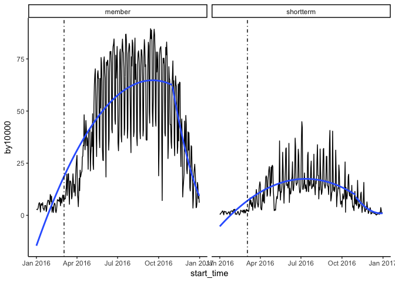
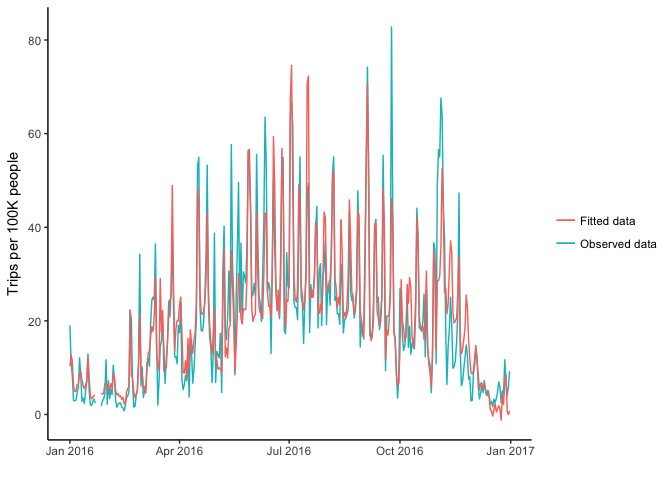
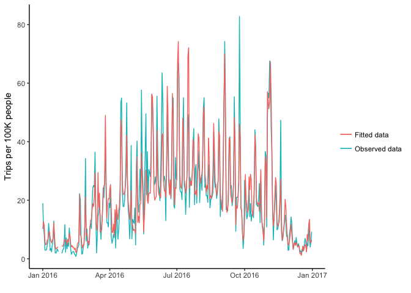
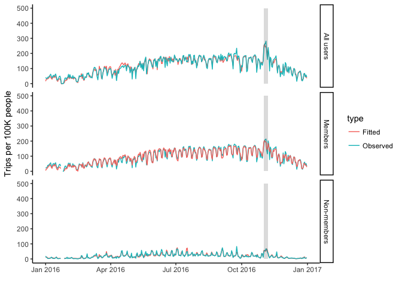
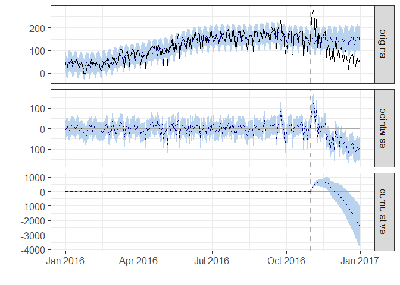

```r
library(stringr)
library(knitr)
library(tidyverse)
library(lubridate)
library(ggplot2)
library(forecast)
library(tseries)
library(formatR)
library(CausalImpact)
library(zoo)
library(normtest)
library(car)
library(Hmisc)

options(scipen = 2, digits=4)
opts_chunk$set(warning = FALSE, message = FALSE, error = FALSE, tidy = TRUE)
```


```r
city_data <- read.csv("https://raw.githubusercontent.com/walkabilly/Phillybikeshare/master/city_day_sum.csv")
member_data <- read.csv("https://raw.githubusercontent.com/walkabilly/Phillybikeshare/master/MemberColl.csv")
phil_temp16 <- read.csv("https://raw.githubusercontent.com/walkabilly/Phillybikeshare/master/Phil_temp_2016.csv")
```

### Convert start_time from factor to date and creating moving averages

```r
city_data$start_time <- ymd(city_data$start_time)
member_data$start_time <- mdy(member_data$start_time)

city_data <- city_data %>% 
  arrange(desc(start_time),
         (desc(city))
         )

city_data <- city_data %>%
  group_by(city) %>%
    mutate(
      cnt_ma7 = rollmean(by100000, k = 7, fill = by100000),
      cnt_ma30 = rollmean(by100000, k = 30, fill = by100000),
      cnt_ma = rollmean(cnt_ma7, k = 30, fill = by100000)
      ## ADD Deseason variable
    )

member_data <- member_data %>%
  group_by(city, membertype) %>%
    mutate(
      cnt_ma7 = rollmean(by10000, k = 7, fill = by10000),
      cnt_ma30 = rollmean(by10000, k = 30, fill = by10000),
      cnt_ma = rollmean(cnt_ma7, k = 30, fill = by10000)
    )
```

### Time Series Plot 

#### All bikeshare users (members and non-members)


```r
cityplot <- ggplot(data = city_data, aes(x = start_time, y = by100000)) + geom_line() + 
    stat_smooth(aes(group = dummy), method = "lm", formula = y ~ poly(x, 2), 
        se = FALSE) + geom_vline(xintercept = as.numeric(city_data$start_time[""]), 
    linetype = 4) + facet_wrap(~city) + theme_classic()


plot(cityplot)
```

<!-- -->

#### Data cleaning Bikeshare member type by city

#### Philadelphia


```r
philly_mem_data <- filter(member_data, city == "Philly")

philly_member_plot <- ggplot(data = philly_mem_data, aes(x = start_time, y = by10000)) + 
    geom_line() + stat_smooth(aes(group = dummy), method = "lm", formula = y ~ 
    poly(x, 2), se = FALSE) + geom_vline(xintercept = as.numeric(city_data$start_time[1215]), 
    linetype = 4) + facet_wrap(~membertype) + theme_classic()

plot(philly_member_plot)
```

<!-- -->

#### Boston


```r
boston_mem_data <- filter(member_data, city == "Boston")

boston_member_plot <- ggplot(data = boston_mem_data, aes(x = start_time, y = by10000)) + 
    geom_line() + stat_smooth(aes(group = dummy), method = "lm", formula = y ~ 
    poly(x, 2), se = FALSE) + geom_vline(xintercept = as.numeric(city_data$start_time[1215]), 
    linetype = 4) + facet_wrap(~membertype) + theme_classic()

plot(boston_member_plot)
```

<!-- -->

#### Chicago


```r
chicago_mem_data <- filter(member_data, city == "Chicago")

chicago_member_plot <- ggplot(data = chicago_mem_data, aes(x = start_time, y = by10000)) + 
    geom_line() + stat_smooth(aes(group = dummy), method = "lm", formula = y ~ 
    poly(x, 2), se = FALSE) + geom_vline(xintercept = as.numeric(city_data$start_time[1215]), 
    linetype = 4) + facet_wrap(~membertype) + theme_classic()

plot(chicago_member_plot)
```

<!-- -->

#### Washington


```r
washington_mem_data <- filter(member_data, city == "Washington")

washington_member_plot <- ggplot(data = washington_mem_data, aes(x = start_time, 
    y = by10000)) + geom_line() + stat_smooth(aes(group = dummy), method = "lm", 
    formula = y ~ poly(x, 2), se = FALSE) + geom_vline(xintercept = as.numeric(city_data$start_time[1215]), 
    linetype = 4) + facet_wrap(~membertype) + theme_classic()

plot(washington_member_plot)
```

<!-- -->

#### Trip duration time series plot

```r
Philly_dur_data <- filter(city_data, city == "Philly")

cityplot_dur_Philly <- ggplot(data = Philly_dur_data, aes(x = start_time, y = mDuration/60)) + 
    geom_line() + stat_smooth(aes(group = dummy), method = "lm", formula = y ~ 
    poly(x, 2), se = FALSE) + geom_vline(xintercept = as.numeric(city_data$start_time[""]), 
    linetype = 4) + facet_wrap(~city) + theme_classic()


plot(cityplot_dur_Philly)
```

<!-- -->


### Data analysis

#### Moving Averages


```r
smooth_plot <- ggplot(city_data) + geom_line(aes(x = start_time, y = by100000, 
    colour = "Count")) + geom_line(aes(x = start_time, y = cnt_ma7, colour = "Weekly Moving Average")) + 
    geom_line(aes(x = start_time, y = cnt_ma30, colour = "Monthly Moving Average")) + 
    geom_vline(xintercept = as.numeric(city_data$start_time[1215]), linetype = 4) + 
    facet_wrap(~city) + theme_classic() + ylab("Number of Trips x 100000 person")
plot(smooth_plot)
```

<!-- -->


#### Model 1: Linear Model on Trips per 100K people
#### Covaraites: (1) daily average temperature; (2) daily average precipitation; (3) dummy varaible: 0 - no strike, 1 - strike; (4) Trips per 100K, Boston; (5) Trips per 100K, Washington DC; (6) Trips per 100K, Chicago; (7) time; (8) Interaction between time and dummy


```r
trip_Philly <- arrange(dplyr::select(filter(city_data, city == "Philly"), by100000, 
    dummy, start_time), start_time)
trip_Boston <- arrange(dplyr::select(filter(city_data, city == "Boston"), by100000, 
    start_time), start_time)
trip_Washington <- arrange(dplyr::select(filter(city_data, city == "Washington"), 
    by100000, start_time), start_time)
trip_Chicago <- arrange(dplyr::select(filter(city_data, city == "Chicago"), 
    by100000, start_time), start_time)

time <- 1:366

## Model 1.1
lm_tripRate <- lm(trip_Philly$by100000 ~ phil_temp16$MEAN + phil_temp16$PRCP + 
    trip_Philly$dummy + trip_Boston$by100000 + trip_Washington$by100000 + trip_Chicago$by100000 + 
    time + time * trip_Philly$dummy)

summary(lm_tripRate)
```

```
## 
## Call:
## lm(formula = trip_Philly$by100000 ~ phil_temp16$MEAN + phil_temp16$PRCP + 
##     trip_Philly$dummy + trip_Boston$by100000 + trip_Washington$by100000 + 
##     trip_Chicago$by100000 + time + time * trip_Philly$dummy)
## 
## Residuals:
##    Min     1Q Median     3Q    Max 
## -77.41  -8.01   0.53   8.21  76.36 
## 
## Coefficients:
##                           Estimate Std. Error t value Pr(>|t|)    
## (Intercept)               -3.20514    4.10611   -0.78    0.436    
## phil_temp16$MEAN          -0.20528    0.10243   -2.00    0.046 *  
## phil_temp16$PRCP          -4.91943    2.04840   -2.40    0.017 *  
## trip_Philly$dummy        439.49308   44.39220    9.90   <2e-16 ***
## trip_Boston$by100000       0.07404    0.00609   12.16   <2e-16 ***
## trip_Washington$by100000   0.04966    0.00291   17.04   <2e-16 ***
## trip_Chicago$by100000      0.01614    0.00875    1.85    0.066 .  
## time                       0.10021    0.01768    5.67    3e-08 ***
## trip_Philly$dummy:time    -1.29009    0.13678   -9.43   <2e-16 ***
## ---
## Signif. codes:  0 '***' 0.001 '**' 0.01 '*' 0.05 '.' 0.1 ' ' 1
## 
## Residual standard error: 16.3 on 357 degrees of freedom
## Multiple R-squared:  0.919,	Adjusted R-squared:  0.917 
## F-statistic:  504 on 8 and 357 DF,  p-value: <2e-16
```

```r
tripPhilly_fitted <- lm_tripRate$fitted.values
lm_plot_tripRate <- ggplot(trip_Philly) + geom_line(aes(x = start_time, y = by100000)) + 
    geom_line(aes(x = start_time, y = tripPhilly_fitted, colour = "#339999")) + 
    theme_classic() + ylab("Trips per 100K people")

plot(lm_plot_tripRate)
```

<!-- -->

```r
## Model 1.2 Accounting for the potential quadratic trend of the data (time
## squared). This term captures the curvature of the trend
lm_tripRate2 <- lm(trip_Philly$by100000 ~ phil_temp16$MEAN + phil_temp16$PRCP + 
    trip_Philly$dummy + trip_Boston$by100000 + trip_Washington$by100000 + trip_Chicago$by100000 + 
    poly(time, 2) + I(time^2) * trip_Philly$dummy)  ##Code for time squared interaction is I(time^2)*trip_Philly$dummy

summary(lm_tripRate2)
```

```
## 
## Call:
## lm(formula = trip_Philly$by100000 ~ phil_temp16$MEAN + phil_temp16$PRCP + 
##     trip_Philly$dummy + trip_Boston$by100000 + trip_Washington$by100000 + 
##     trip_Chicago$by100000 + poly(time, 2) + I(time^2) * trip_Philly$dummy)
## 
## Residuals:
##    Min     1Q Median     3Q    Max 
## -77.96  -7.87   0.38   7.20  71.70 
## 
## Coefficients: (1 not defined because of singularities)
##                               Estimate Std. Error t value Pr(>|t|)    
## (Intercept)                  -8.898000   6.087406   -1.46   0.1447    
## phil_temp16$MEAN              0.019368   0.103309    0.19   0.8514    
## phil_temp16$PRCP             -4.020651   1.951243   -2.06   0.0401 *  
## trip_Philly$dummy           227.100414  20.635156   11.01  < 2e-16 ***
## trip_Boston$by100000          0.082572   0.005923   13.94  < 2e-16 ***
## trip_Washington$by100000      0.052134   0.002792   18.67  < 2e-16 ***
## trip_Chicago$by100000         0.027974   0.008484    3.30   0.0011 ** 
## poly(time, 2)1              174.431259  34.157771    5.11  5.4e-07 ***
## poly(time, 2)2              232.339691  35.471706    6.55  2.0e-10 ***
## I(time^2)                           NA         NA      NA       NA    
## trip_Philly$dummy:I(time^2)  -0.002017   0.000194  -10.39  < 2e-16 ***
## ---
## Signif. codes:  0 '***' 0.001 '**' 0.01 '*' 0.05 '.' 0.1 ' ' 1
## 
## Residual standard error: 15.5 on 356 degrees of freedom
## Multiple R-squared:  0.927,	Adjusted R-squared:  0.925 
## F-statistic:  501 on 9 and 356 DF,  p-value: <2e-16
```

```r
tripPhilly_fitted2 <- lm_tripRate2$fitted.values
lm_plot_tripRate2 <- ggplot(trip_Philly) + geom_line(aes(x = start_time, y = by100000)) + 
    geom_line(aes(x = start_time, y = tripPhilly_fitted2, colour = "#339999")) + 
    theme_classic() + ylab("Trips per 100K people")

plot(lm_plot_tripRate2)
```

<!-- -->


#### Model2: Linear model on Trips per 100K people, weekly moving average

```r
trip_Philly_MA <- arrange(dplyr::select(filter(city_data, city == "Philly"), 
    cnt_ma7, dummy, start_time), start_time)
trip_Boston_MA <- arrange(dplyr::select(filter(city_data, city == "Boston"), 
    cnt_ma7, start_time), start_time)
trip_Washington_MA <- arrange(dplyr::select(filter(city_data, city == "Washington"), 
    cnt_ma7, start_time), start_time)
trip_Chicago_MA <- arrange(dplyr::select(filter(city_data, city == "Chicago"), 
    cnt_ma7, start_time), start_time)

time_MA <- 1:366

## Model 2.1
lm_tripRate_MA <- lm(trip_Philly_MA$cnt_ma7 ~ phil_temp16$MEAN + phil_temp16$PRCP + 
    trip_Philly_MA$dummy + trip_Boston_MA$cnt_ma7 + trip_Washington_MA$cnt_ma7 + 
    trip_Chicago_MA$cnt_ma7 + time_MA + time_MA * trip_Philly_MA$dummy)

summary(lm_tripRate_MA)
```

```
## 
## Call:
## lm(formula = trip_Philly_MA$cnt_ma7 ~ phil_temp16$MEAN + phil_temp16$PRCP + 
##     trip_Philly_MA$dummy + trip_Boston_MA$cnt_ma7 + trip_Washington_MA$cnt_ma7 + 
##     trip_Chicago_MA$cnt_ma7 + time_MA + time_MA * trip_Philly_MA$dummy)
## 
## Residuals:
##    Min     1Q Median     3Q    Max 
## -25.38  -5.13  -0.89   4.61  44.54 
## 
## Coefficients:
##                               Estimate Std. Error t value Pr(>|t|)    
## (Intercept)                    0.47913    2.52384    0.19    0.850    
## phil_temp16$MEAN              -0.05597    0.06324   -0.89    0.377    
## phil_temp16$PRCP              -2.06822    1.05994   -1.95    0.052 .  
## trip_Philly_MA$dummy         494.08561   25.43292   19.43  < 2e-16 ***
## trip_Boston_MA$cnt_ma7         0.04385    0.00696    6.30  8.7e-10 ***
## trip_Washington_MA$cnt_ma7     0.03184    0.00239   13.30  < 2e-16 ***
## trip_Chicago_MA$cnt_ma7        0.06415    0.01004    6.39  5.2e-10 ***
## time_MA                        0.16211    0.01149   14.11  < 2e-16 ***
## trip_Philly_MA$dummy:time_MA  -1.49235    0.07944  -18.79  < 2e-16 ***
## ---
## Signif. codes:  0 '***' 0.001 '**' 0.01 '*' 0.05 '.' 0.1 ' ' 1
## 
## Residual standard error: 8.56 on 357 degrees of freedom
## Multiple R-squared:  0.972,	Adjusted R-squared:  0.972 
## F-statistic: 1.56e+03 on 8 and 357 DF,  p-value: <2e-16
```

```r
tripPhilly_fitted_MA <- lm_tripRate_MA$fitted.values
lm_plot_tripRate_MA <- ggplot(trip_Philly_MA) + geom_line(aes(x = start_time, 
    y = cnt_ma7)) + geom_line(aes(x = start_time, y = tripPhilly_fitted_MA, 
    colour = "#339999")) + theme_classic() + ylab("Trips per 100K people_Weekly moving average")

plot(lm_plot_tripRate_MA)
```

<!-- -->

```r
### Accounting for the potential quadratic trend of the data (time squared).
### This term captures the curvature of the trend
lm_tripRate_MA2 <- lm(trip_Philly_MA$cnt_ma7 ~ phil_temp16$MEAN + phil_temp16$PRCP + 
    trip_Philly_MA$dummy + trip_Boston_MA$cnt_ma7 + trip_Washington_MA$cnt_ma7 + 
    trip_Chicago_MA$cnt_ma7 + poly(time_MA, 2) + time_MA * trip_Philly_MA$dummy)

summary(lm_tripRate_MA2)
```

```
## 
## Call:
## lm(formula = trip_Philly_MA$cnt_ma7 ~ phil_temp16$MEAN + phil_temp16$PRCP + 
##     trip_Philly_MA$dummy + trip_Boston_MA$cnt_ma7 + trip_Washington_MA$cnt_ma7 + 
##     trip_Chicago_MA$cnt_ma7 + poly(time_MA, 2) + time_MA * trip_Philly_MA$dummy)
## 
## Residuals:
##    Min     1Q Median     3Q    Max 
## -21.00  -3.94   0.19   3.05  41.87 
## 
## Coefficients: (1 not defined because of singularities)
##                               Estimate Std. Error t value Pr(>|t|)    
## (Intercept)                    2.99580    3.47796    0.86     0.39    
## phil_temp16$MEAN               0.00815    0.05421    0.15     0.88    
## phil_temp16$PRCP              -1.03466    0.90822   -1.14     0.26    
## trip_Philly_MA$dummy         459.81057   21.88761   21.01  < 2e-16 ***
## trip_Boston_MA$cnt_ma7         0.06572    0.00623   10.55  < 2e-16 ***
## trip_Washington_MA$cnt_ma7     0.04036    0.00217   18.60  < 2e-16 ***
## trip_Chicago_MA$cnt_ma7        0.06645    0.00857    7.76  9.2e-14 ***
## poly(time_MA, 2)1            242.54267   21.11456   11.49  < 2e-16 ***
## poly(time_MA, 2)2            220.20930   18.95678   11.62  < 2e-16 ***
## time_MA                             NA         NA      NA       NA    
## trip_Philly_MA$dummy:time_MA  -1.39225    0.06829  -20.39  < 2e-16 ***
## ---
## Signif. codes:  0 '***' 0.001 '**' 0.01 '*' 0.05 '.' 0.1 ' ' 1
## 
## Residual standard error: 7.3 on 356 degrees of freedom
## Multiple R-squared:  0.98,	Adjusted R-squared:  0.979 
## F-statistic: 1.92e+03 on 9 and 356 DF,  p-value: <2e-16
```

```r
tripPhilly_fitted_MA2 <- lm_tripRate_MA2$fitted.values
lm_plot_tripRate_MA2 <- ggplot(trip_Philly_MA) + geom_line(aes(x = start_time, 
    y = cnt_ma7)) + geom_line(aes(x = start_time, y = tripPhilly_fitted_MA2, 
    colour = "#339999")) + theme_classic() + ylab("Trips per 100K people_Weekly moving average")

plot(lm_plot_tripRate_MA2)
```

<!-- -->

#### Trip duration as the outcome

```r
trip_Philly_dur <- arrange(dplyr::select(filter(city_data, city == "Philly"), 
    mDuration, dummy, start_time), start_time)
trip_Boston_dur <- arrange(dplyr::select(filter(city_data, city == "Boston"), 
    mDuration, start_time), start_time)
trip_Washington_dur <- arrange(dplyr::select(filter(city_data, city == "Washington"), 
    mDuration, start_time), start_time)
trip_Chicago_dur <- arrange(dplyr::select(filter(city_data, city == "Chicago"), 
    mDuration, start_time), start_time)

time_dur <- 1:366
Philly_dur <- trip_Philly_dur$mDuration/60
Boston_dur <- trip_Boston_dur$mDuration/60
Washington_dur <- trip_Washington_dur$mDuration/60
Chicago_dur <- trip_Chicago_dur$mDuration/60

lm_tripRate_dur <- lm(Philly_dur ~ phil_temp16$MEAN + phil_temp16$PRCP + trip_Philly_dur$dummy + 
    Boston_dur + Washington_dur + Chicago_dur + time_dur + time_dur * trip_Philly_dur$dummy)

summary(lm_tripRate_dur)
```

```
## 
## Call:
## lm(formula = Philly_dur ~ phil_temp16$MEAN + phil_temp16$PRCP + 
##     trip_Philly_dur$dummy + Boston_dur + Washington_dur + Chicago_dur + 
##     time_dur + time_dur * trip_Philly_dur$dummy)
## 
## Residuals:
##    Min     1Q Median     3Q    Max 
## -20.98  -3.56  -0.98   1.61 227.93 
## 
## Coefficients:
##                                  Estimate Std. Error t value  Pr(>|t|)    
## (Intercept)                     16.175453   3.381803    4.78 0.0000025 ***
## phil_temp16$MEAN                -0.106512   0.067413   -1.58     0.115    
## phil_temp16$PRCP                -0.059726   1.693871   -0.04     0.972    
## trip_Philly_dur$dummy          -53.274778  34.609394   -1.54     0.125    
## Boston_dur                      -0.020461   0.030891   -0.66     0.508    
## Washington_dur                   0.000561   0.000243    2.31     0.022 *  
## Chicago_dur                      0.654281   0.346532    1.89     0.060 .  
## time_dur                        -0.034407   0.012683   -2.71     0.007 ** 
## trip_Philly_dur$dummy:time_dur   0.177436   0.105310    1.68     0.093 .  
## ---
## Signif. codes:  0 '***' 0.001 '**' 0.01 '*' 0.05 '.' 0.1 ' ' 1
## 
## Residual standard error: 13.7 on 357 degrees of freedom
## Multiple R-squared:  0.109,	Adjusted R-squared:  0.089 
## F-statistic: 5.46 on 8 and 357 DF,  p-value: 0.00000167
```

#### Model 3: Trip rate_membership as the outcome

```r
trip_Philly_mem <- arrange(dplyr::select(filter(member_data, city == "Philly" & 
    membertype == "member"), by10000, dummy, start_time), start_time)  ##Two-day data missing 01-23 and 01-24
trip_Boston_mem <- arrange(dplyr::select(filter(member_data, city == "Boston" & 
    membertype == "member"), by10000, start_time), start_time)
trip_Washington_mem <- arrange(dplyr::select(filter(member_data, city == "Washington" & 
    membertype == "member"), by10000, start_time), start_time)  ##Four-day data missing: 01-23 ~ 01-26
trip_Chicago_mem <- arrange(dplyr::select(filter(member_data, city == "Chicago" & 
    membertype == "member"), by10000, start_time), start_time)

time_mem <- 1:366

## Fill in the missing data
trip_Philly_mem[365, "start_time"] <- "2016-01-23"
trip_Philly_mem[366, "start_time"] <- "2016-01-24"
trip_Philly_mem <- arrange(trip_Philly_mem, start_time)

trip_Washington_mem[363, "start_time"] <- "2016-01-23"
trip_Washington_mem[364, "start_time"] <- "2016-01-24"
trip_Washington_mem[365, "start_time"] <- "2016-01-25"
trip_Washington_mem[366, "start_time"] <- "2016-01-26"
trip_Washington_mem <- arrange(trip_Washington_mem, start_time)

Philly_mem <- trip_Philly_mem$by10000 * 10
Boston_mem <- trip_Boston_mem$by10000 * 10
Washington_mem <- trip_Washington_mem$by10000 * 10
Chicago_mem <- trip_Chicago_mem$by10000 * 10

## Model 3.1
lm_tripRate_mem <- lm(Philly_mem ~ phil_temp16$MEAN + phil_temp16$PRCP + trip_Philly_mem$dummy + 
    Boston_mem + Washington_mem + Chicago_mem + time_mem + time_mem * trip_Philly_mem$dummy)

summary(lm_tripRate_mem)
```

```
## 
## Call:
## lm(formula = Philly_mem ~ phil_temp16$MEAN + phil_temp16$PRCP + 
##     trip_Philly_mem$dummy + Boston_mem + Washington_mem + Chicago_mem + 
##     time_mem + time_mem * trip_Philly_mem$dummy)
## 
## Residuals:
##    Min     1Q Median     3Q    Max 
## -63.88  -6.00   0.28   7.39  42.10 
## 
## Coefficients:
##                                 Estimate Std. Error t value Pr(>|t|)    
## (Intercept)                    -12.01371    3.47388   -3.46  0.00061 ***
## phil_temp16$MEAN                -0.08383    0.06582   -1.27  0.20360    
## phil_temp16$PRCP                -6.06019    1.56907   -3.86  0.00013 ***
## trip_Philly_mem$dummy          336.00885   33.47387   10.04  < 2e-16 ***
## Boston_mem                       0.06056    0.00615    9.84  < 2e-16 ***
## Washington_mem                   0.05232    0.00306   17.10  < 2e-16 ***
## Chicago_mem                      0.02789    0.01175    2.37  0.01818 *  
## time_mem                         0.13474    0.01343   10.03  < 2e-16 ***
## trip_Philly_mem$dummy:time_mem  -1.01387    0.10265   -9.88  < 2e-16 ***
## ---
## Signif. codes:  0 '***' 0.001 '**' 0.01 '*' 0.05 '.' 0.1 ' ' 1
## 
## Residual standard error: 12.6 on 353 degrees of freedom
##   (4 observations deleted due to missingness)
## Multiple R-squared:  0.932,	Adjusted R-squared:  0.93 
## F-statistic:  604 on 8 and 353 DF,  p-value: <2e-16
```

```r
tripPhilly_fitted_mem <- lm_tripRate_mem$fitted.values
fitted_all <- vector(length = 366)
fitted_all[1:22] <- tripPhilly_fitted_mem[1:22]
fitted_all[23:26] <- NA
fitted_all[27:366] <- tripPhilly_fitted_mem[23:362]

lm_plot_mem <- ggplot(trip_Philly_mem) + geom_line(aes(x = start_time, y = Philly_mem)) + 
    geom_line(aes(x = start_time, y = fitted_all, colour = "#339999")) + theme_classic() + 
    ylab("Trips per 100K people")

plot(lm_plot_mem)
```

<!-- -->

#### Model4: Trip rate_shortterm as the outcome

```r
trip_Philly_short <- arrange(dplyr::select(filter(member_data, city == "Philly" & 
    membertype == "shortterm"), by10000, dummy, start_time), start_time)  ##Four-day data missing 01-23 and 01-26
trip_Boston_short <- arrange(dplyr::select(filter(member_data, city == "Boston" & 
    membertype == "shortterm"), by10000, start_time), start_time)
trip_Washington_short <- arrange(dplyr::select(filter(member_data, city == "Washington" & 
    membertype == "shortterm"), by10000, start_time), start_time)  ##Four-day data missing: 01-23 ~ 01-26
trip_Chicago_short <- arrange(dplyr::select(filter(member_data, city == "Chicago" & 
    membertype == "shortterm"), by10000, start_time), start_time)

time_short <- 1:366

## Fill in the missing data
trip_Philly_short[363, "start_time"] <- "2016-01-23"
trip_Philly_short[364, "start_time"] <- "2016-01-24"
trip_Philly_short[365, "start_time"] <- "2016-01-25"
trip_Philly_short[366, "start_time"] <- "2016-01-26"
trip_Philly_short <- arrange(trip_Philly_short, start_time)

trip_Washington_short[363, "start_time"] <- "2016-01-23"
trip_Washington_short[364, "start_time"] <- "2016-01-24"
trip_Washington_short[365, "start_time"] <- "2016-01-25"
trip_Washington_short[366, "start_time"] <- "2016-01-26"
trip_Washington_short <- arrange(trip_Washington_short, start_time)

Philly_short <- trip_Philly_short$by10000 * 10
Boston_short <- trip_Boston_short$by10000 * 10
Washington_short <- trip_Washington_short$by10000 * 10
Chicago_short <- trip_Chicago_short$by10000 * 10

## Model 4.1
lm_tripRate_short <- lm(Philly_short ~ phil_temp16$MEAN + phil_temp16$PRCP + 
    trip_Philly_short$dummy + Boston_short + Washington_short + Chicago_short + 
    time_short + time_short * trip_Philly_short$dummy)

summary(lm_tripRate_short)
```

```
## 
## Call:
## lm(formula = Philly_short ~ phil_temp16$MEAN + phil_temp16$PRCP + 
##     trip_Philly_short$dummy + Boston_short + Washington_short + 
##     Chicago_short + time_short + time_short * trip_Philly_short$dummy)
## 
## Residuals:
##    Min     1Q Median     3Q    Max 
## -23.29  -3.00  -0.91   2.24  36.66 
## 
## Coefficients:
##                                     Estimate Std. Error t value Pr(>|t|)
## (Intercept)                          1.76579    1.59594    1.11    0.269
## phil_temp16$MEAN                     0.05643    0.03633    1.55    0.121
## phil_temp16$PRCP                    -0.77999    0.88054   -0.89    0.376
## trip_Philly_short$dummy            121.67556   17.47456    6.96  1.6e-11
## Boston_short                         0.03154    0.00715    4.41  1.4e-05
## Washington_short                     0.03806    0.00295   12.90  < 2e-16
## Chicago_short                        0.03107    0.00711    4.37  1.6e-05
## time_short                          -0.01610    0.00645   -2.50    0.013
## trip_Philly_short$dummy:time_short  -0.34192    0.05308   -6.44  3.9e-10
##                                       
## (Intercept)                           
## phil_temp16$MEAN                      
## phil_temp16$PRCP                      
## trip_Philly_short$dummy            ***
## Boston_short                       ***
## Washington_short                   ***
## Chicago_short                      ***
## time_short                         *  
## trip_Philly_short$dummy:time_short ***
## ---
## Signif. codes:  0 '***' 0.001 '**' 0.01 '*' 0.05 '.' 0.1 ' ' 1
## 
## Residual standard error: 6.93 on 353 degrees of freedom
##   (4 observations deleted due to missingness)
## Multiple R-squared:  0.808,	Adjusted R-squared:  0.804 
## F-statistic:  186 on 8 and 353 DF,  p-value: <2e-16
```

```r
tripPhilly_fitted_short <- lm_tripRate_short$fitted.values
fitted_all_short <- vector(length = 366)
fitted_all_short[1:22] <- tripPhilly_fitted_short[1:22]
fitted_all_short[23:26] <- NA
fitted_all_short[27:366] <- tripPhilly_fitted_short[23:362]

lm_plot_short <- ggplot(trip_Philly_short) + geom_line(aes(x = start_time, y = Philly_short)) + 
    geom_line(aes(x = start_time, y = fitted_all_short, colour = "#339999")) + 
    theme_classic() + ylab("Trips per 100K people")

plot(lm_plot_short)
```

<!-- -->


### Subset to create datasets for each city


```r
## All data
philly_data <- arrange(filter(city_data, city == "Philly"), start_time)
boston_data <- arrange(filter(city_data, city == "Boston"), start_time)
chicago_data <- arrange(filter(city_data, city == "Chicago"), start_time)
washington_data <- arrange(filter(city_data, city == "Washington"), start_time)
```

### Model5: Philly CausalImpact

#### Set pre- and post-periods

```r
## Set pre- and post-periods
pre_period <- as.Date(c("2016-01-01", "2016-10-31"))
post_period <- as.Date(c("2016-11-01", "2016-12-31"))
post_period2 <- as.Date(c("2016-11-01", "2016-11-07"))  ##Assess the impact one week after the strike
```

#### Modelling all Philadelphia data

```r
philly_all <- zoo(cbind(philly_data$by100000, phil_temp16$MEAN, phil_temp16$PRCP, 
    boston_data$by100000, washington_data$by100000, chicago_data$by100000), 
    as.Date(philly_data$start_time))

## Model5.1: Modelling without covaraites
impact_phil <- CausalImpact(data = philly_all[, 1], pre.period = pre_period, 
    post.period = post_period, model.args = list(niter = 5000, nseasons = 7))
summary(impact_phil)
```

```
## Posterior inference {CausalImpact}
## 
##                          Average        Cumulative    
## Actual                   108            6588          
## Prediction (s.d.)        148 (12)       9009 (710)    
## 95% CI                   [125, 170]     [7597, 10365] 
##                                                       
## Absolute effect (s.d.)   -40 (12)       -2421 (710)   
## 95% CI                   [-62, -17]     [-3777, -1010]
##                                                       
## Relative effect (s.d.)   -27% (7.9%)    -27% (7.9%)   
## 95% CI                   [-42%, -11%]   [-42%, -11%]  
## 
## Posterior tail-area probability p:   0.00061
## Posterior prob. of a causal effect:  99.93897%
## 
## For more details, type: summary(impact, "report")
```

```r
plot(impact_phil)
```

<!-- -->

```r
## Model5.2:Modelling with covaraites: temperature; precipitation; trip-rate
## in other three cities
impact_phil2 <- CausalImpact(data = philly_all, pre.period = pre_period, post.period = post_period, 
    model.args = list(niter = 5000, nseasons = 7))
summary(impact_phil2, "report")
```

```
## Analysis report {CausalImpact}
## 
## 
## During the post-intervention period, the response variable had an average value of approx. 108.00. In the absence of an intervention, we would have expected an average response of 97.31. The 95% interval of this counterfactual prediction is [86.49, 108.27]. Subtracting this prediction from the observed response yields an estimate of the causal effect the intervention had on the response variable. This effect is 10.69 with a 95% interval of [-0.28, 21.51]. For a discussion of the significance of this effect, see below.
## 
## Summing up the individual data points during the post-intervention period (which can only sometimes be meaningfully interpreted), the response variable had an overall value of 6.59K. Had the intervention not taken place, we would have expected a sum of 5.94K. The 95% interval of this prediction is [5.28K, 6.60K].
## 
## The above results are given in terms of absolute numbers. In relative terms, the response variable showed an increase of +11%. The 95% interval of this percentage is [-0%, +22%].
## 
## This means that, although the intervention appears to have caused a positive effect, this effect is not statistically significant when considering the entire post-intervention period as a whole. Individual days or shorter stretches within the intervention period may of course still have had a significant effect, as indicated whenever the lower limit of the impact time series (lower plot) was above zero. The apparent effect could be the result of random fluctuations that are unrelated to the intervention. This is often the case when the intervention period is very long and includes much of the time when the effect has already worn off. It can also be the case when the intervention period is too short to distinguish the signal from the noise. Finally, failing to find a significant effect can happen when there are not enough control variables or when these variables do not correlate well with the response variable during the learning period.
## 
## The probability of obtaining this effect by chance is very small (Bayesian one-sided tail-area probability p = 0.027). This means the causal effect can be considered statistically significant.
```

```r
plot(impact_phil2, c("original", "pointwise"))
```

<!-- -->

```r
# plot(impact_phil2$model$bsts.model,'coefficients')

## Model5.3:Post-period set as one week after the strike
impact_phil3 <- CausalImpact(data = philly_all, pre.period = pre_period, post.period = post_period2, 
    model.args = list(niter = 5000, nseasons = 7))
summary(impact_phil3, "report")
```

```
## Analysis report {CausalImpact}
## 
## 
## During the post-intervention period, the response variable had an average value of approx. 234.37. By contrast, in the absence of an intervention, we would have expected an average response of 148.90. The 95% interval of this counterfactual prediction is [136.39, 161.60]. Subtracting this prediction from the observed response yields an estimate of the causal effect the intervention had on the response variable. This effect is 85.47 with a 95% interval of [72.77, 97.98]. For a discussion of the significance of this effect, see below.
## 
## Summing up the individual data points during the post-intervention period (which can only sometimes be meaningfully interpreted), the response variable had an overall value of 1.64K. By contrast, had the intervention not taken place, we would have expected a sum of 1.04K. The 95% interval of this prediction is [0.95K, 1.13K].
## 
## The above results are given in terms of absolute numbers. In relative terms, the response variable showed an increase of +57%. The 95% interval of this percentage is [+49%, +66%].
## 
## This means that the positive effect observed during the intervention period is statistically significant and unlikely to be due to random fluctuations. It should be noted, however, that the question of whether this increase also bears substantive significance can only be answered by comparing the absolute effect (85.47) to the original goal of the underlying intervention.
## 
## The probability of obtaining this effect by chance is very small (Bayesian one-sided tail-area probability p = 0). This means the causal effect can be considered statistically significant.
```

```r
plot(impact_phil3, c("original", "pointwise"))
```

<!-- -->

```r
# ##Dynamic regression: whether to include a time-varying regression
# coefficient. Default is FALSE impact_phil4 <- CausalImpact(data = data,
# pre.period = pre.period, post.period = post.period, model.args =
# list(niter=5000, nseasons=7, dynamic.regression=T)) ##Control monthly
# effect impact_phil5 <- CausalImpact(data = data, pre.period = pre.period,
# post.period = post.period, model.args = list(niter=5000, nseasons=12,
# season.duration= 30)) ##Control seasonal effect impact_phil6 <-
# CausalImpact(data = data, pre.period = pre.period, post.period =
# post.period, model.args = list(niter=5000, nseasons=4))

# plot(impact_phil4) ##Not a good fit!!!  plot(impact_phil5) ##Not a good
# fit!!!  plot(impact_phil6) ##Not a good fit!!!
```


#### Modelling Philadelphia data_membership

```r
## CausalImpact does not support missing covariaets: Impute missing trip data
## with weekly moving average
Washington_mem[23:26] <- trip_Washington_MA$cnt_ma7[23:26]

philly_mem_ci <- zoo(cbind(Philly_mem, MEAN = phil_temp16$MEAN, PRCP = phil_temp16$PRCP, 
    Boston_mem, Washington_mem, Chicago_mem), as.Date(philly_data$start_time))

## Model5.4
impact_phil_mem <- CausalImpact(data = philly_mem_ci, pre.period = pre_period, 
    post.period = post_period, model.args = list(niter = 5000, nseasons = 7))
summary(impact_phil_mem, "report")
```

```
## Analysis report {CausalImpact}
## 
## 
## During the post-intervention period, the response variable had an average value of approx. 93.77. In the absence of an intervention, we would have expected an average response of 93.34. The 95% interval of this counterfactual prediction is [83.94, 102.79]. Subtracting this prediction from the observed response yields an estimate of the causal effect the intervention had on the response variable. This effect is 0.43 with a 95% interval of [-9.02, 9.83]. For a discussion of the significance of this effect, see below.
## 
## Summing up the individual data points during the post-intervention period (which can only sometimes be meaningfully interpreted), the response variable had an overall value of 5.72K. Had the intervention not taken place, we would have expected a sum of 5.69K. The 95% interval of this prediction is [5.12K, 6.27K].
## 
## The above results are given in terms of absolute numbers. In relative terms, the response variable showed an increase of +0%. The 95% interval of this percentage is [-10%, +11%].
## 
## This means that, although the intervention appears to have caused a positive effect, this effect is not statistically significant when considering the entire post-intervention period as a whole. Individual days or shorter stretches within the intervention period may of course still have had a significant effect, as indicated whenever the lower limit of the impact time series (lower plot) was above zero. The apparent effect could be the result of random fluctuations that are unrelated to the intervention. This is often the case when the intervention period is very long and includes much of the time when the effect has already worn off. It can also be the case when the intervention period is too short to distinguish the signal from the noise. Finally, failing to find a significant effect can happen when there are not enough control variables or when these variables do not correlate well with the response variable during the learning period.
## 
## The probability of obtaining this effect by chance is p = 0.457. This means the effect may be spurious and would generally not be considered statistically significant.
```

```r
plot(impact_phil_mem, c("original", "pointwise"))
```

<!-- -->

```r
## Model5.5
impact_phil_mem2 <- CausalImpact(data = philly_mem_ci, pre.period = pre_period, 
    post.period = post_period2, model.args = list(niter = 5000, nseasons = 7))
summary(impact_phil_mem2, "report")
```

```
## Analysis report {CausalImpact}
## 
## 
## During the post-intervention period, the response variable had an average value of approx. 181.01. By contrast, in the absence of an intervention, we would have expected an average response of 131.82. The 95% interval of this counterfactual prediction is [121.36, 142.48]. Subtracting this prediction from the observed response yields an estimate of the causal effect the intervention had on the response variable. This effect is 49.18 with a 95% interval of [38.53, 59.65]. For a discussion of the significance of this effect, see below.
## 
## Summing up the individual data points during the post-intervention period (which can only sometimes be meaningfully interpreted), the response variable had an overall value of 1.27K. By contrast, had the intervention not taken place, we would have expected a sum of 0.92K. The 95% interval of this prediction is [0.85K, 1.00K].
## 
## The above results are given in terms of absolute numbers. In relative terms, the response variable showed an increase of +37%. The 95% interval of this percentage is [+29%, +45%].
## 
## This means that the positive effect observed during the intervention period is statistically significant and unlikely to be due to random fluctuations. It should be noted, however, that the question of whether this increase also bears substantive significance can only be answered by comparing the absolute effect (49.18) to the original goal of the underlying intervention.
## 
## The probability of obtaining this effect by chance is very small (Bayesian one-sided tail-area probability p = 0). This means the causal effect can be considered statistically significant.
```

```r
plot(impact_phil_mem2, c("original", "pointwise"))
```

<!-- -->

#### Modelling Philadelphia data_shortterm

```r
## CausalImpact does not support missing covariaets: Impute missing trip data
## with weekly moving average
Washington_short[23:26] <- trip_Washington_MA$cnt_ma7[23:26]

philly_short_ci <- zoo(cbind(Philly_short, MEAN = phil_temp16$MEAN, PRCP = phil_temp16$PRCP, 
    Boston_short, Washington_short, Chicago_short), as.Date(philly_data$start_time))

## Model5.6
impact_phil_short <- CausalImpact(data = philly_short_ci, pre.period = pre_period, 
    post.period = post_period, model.args = list(niter = 5000, nseasons = 7))
summary(impact_phil_short, "report")
```

```
## Analysis report {CausalImpact}
## 
## 
## During the post-intervention period, the response variable had an average value of approx. 14.23. By contrast, in the absence of an intervention, we would have expected an average response of 9.91. The 95% interval of this counterfactual prediction is [6.53, 13.26]. Subtracting this prediction from the observed response yields an estimate of the causal effect the intervention had on the response variable. This effect is 4.31 with a 95% interval of [0.97, 7.70]. For a discussion of the significance of this effect, see below.
## 
## Summing up the individual data points during the post-intervention period (which can only sometimes be meaningfully interpreted), the response variable had an overall value of 867.93. By contrast, had the intervention not taken place, we would have expected a sum of 604.77. The 95% interval of this prediction is [398.38, 808.67].
## 
## The above results are given in terms of absolute numbers. In relative terms, the response variable showed an increase of +44%. The 95% interval of this percentage is [+10%, +78%].
## 
## This means that the positive effect observed during the intervention period is statistically significant and unlikely to be due to random fluctuations. It should be noted, however, that the question of whether this increase also bears substantive significance can only be answered by comparing the absolute effect (4.31) to the original goal of the underlying intervention.
## 
## The probability of obtaining this effect by chance is very small (Bayesian one-sided tail-area probability p = 0.007). This means the causal effect can be considered statistically significant.
```

```r
plot(impact_phil_short, c("original", "pointwise"))
```

<!-- -->

```r
## Model5.7
impact_phil_short2 <- CausalImpact(data = philly_short_ci, pre.period = pre_period, 
    post.period = post_period2, model.args = list(niter = 5000, nseasons = 7))
summary(impact_phil_short2, "report")
```

```
## Analysis report {CausalImpact}
## 
## 
## During the post-intervention period, the response variable had an average value of approx. 53.36. By contrast, in the absence of an intervention, we would have expected an average response of 19.88. The 95% interval of this counterfactual prediction is [14.98, 25.00]. Subtracting this prediction from the observed response yields an estimate of the causal effect the intervention had on the response variable. This effect is 33.47 with a 95% interval of [28.36, 38.37]. For a discussion of the significance of this effect, see below.
## 
## Summing up the individual data points during the post-intervention period (which can only sometimes be meaningfully interpreted), the response variable had an overall value of 373.50. By contrast, had the intervention not taken place, we would have expected a sum of 139.18. The 95% interval of this prediction is [104.89, 175.00].
## 
## The above results are given in terms of absolute numbers. In relative terms, the response variable showed an increase of +168%. The 95% interval of this percentage is [+143%, +193%].
## 
## This means that the positive effect observed during the intervention period is statistically significant and unlikely to be due to random fluctuations. It should be noted, however, that the question of whether this increase also bears substantive significance can only be answered by comparing the absolute effect (33.47) to the original goal of the underlying intervention.
## 
## The probability of obtaining this effect by chance is very small (Bayesian one-sided tail-area probability p = 0). This means the causal effect can be considered statistically significant.
```

```r
plot(impact_phil_short2, c("original", "pointwise"))
```

<!-- -->

## Boston data analysis

```r
boston_data <- zoo(cbind(boston_data$by100000), as.Date(boston_data$start_time))

impact_bos <- CausalImpact(data = boston_data, pre.period = pre_period, post.period = post_period, 
    model.args = list(niter = 5000, nseasons = 7))
summary(impact_bos)
```

```
## Posterior inference {CausalImpact}
## 
##                          Average        Cumulative     
## Actual                   356            21719          
## Prediction (s.d.)        619 (81)       37763 (4913)   
## 95% CI                   [463, 773]     [28222, 47132] 
##                                                        
## Absolute effect (s.d.)   -263 (81)      -16044 (4913)  
## 95% CI                   [-417, -107]   [-25413, -6503]
##                                                        
## Relative effect (s.d.)   -42% (13%)     -42% (13%)     
## 95% CI                   [-67%, -17%]   [-67%, -17%]   
## 
## Posterior tail-area probability p:   0.00126
## Posterior prob. of a causal effect:  99.87382%
## 
## For more details, type: summary(impact, "report")
```

```r
plot(impact_bos)
```

<!-- -->

## Chicago data anlysis 

```r
chicago_data <- zoo(cbind(chicago_data$by100000), as.Date(chicago_data$start_time))

impact_chi <- CausalImpact(data = chicago_data, pre.period = pre_period, post.period = post_period, 
    model.args = list(niter = 5000, nseasons = 7))
summary(impact_chi)
```

```
## Posterior inference {CausalImpact}
## 
##                          Average        Cumulative     
## Actual                   203            12377          
## Prediction (s.d.)        401 (52)       24465 (3198)   
## 95% CI                   [297, 502]     [18136, 30622] 
##                                                        
## Absolute effect (s.d.)   -198 (52)      -12088 (3198)  
## 95% CI                   [-299, -94]    [-18245, -5759]
##                                                        
## Relative effect (s.d.)   -49% (13%)     -49% (13%)     
## 95% CI                   [-75%, -24%]   [-75%, -24%]   
## 
## Posterior tail-area probability p:   0.00061
## Posterior prob. of a causal effect:  99.93906%
## 
## For more details, type: summary(impact, "report")
```

```r
plot(impact_chi)  ##Not a good fit to the data
```

<!-- -->

## Washington data anlysis 

```r
washington_data <- zoo(cbind(washington_data$by100000), as.Date(washington_data$start_time))

impact_DC <- CausalImpact(data = washington_data, pre.period = pre_period, post.period = post_period, 
    model.args = list(niter = 5000, nseasons = 7))
summary(impact_DC)
```

```
## Posterior inference {CausalImpact}
## 
##                          Average        Cumulative      
## Actual                   1043           63643           
## Prediction (s.d.)        1651 (135)     100700 (8255)   
## 95% CI                   [1380, 1914]   [84167, 116761] 
##                                                         
## Absolute effect (s.d.)   -607 (135)     -37057 (8255)   
## 95% CI                   [-871, -336]   [-53118, -20525]
##                                                         
## Relative effect (s.d.)   -37% (8.2%)    -37% (8.2%)     
## 95% CI                   [-53%, -20%]   [-53%, -20%]    
## 
## Posterior tail-area probability p:   0.0002
## Posterior prob. of a causal effect:  99.9796%
## 
## For more details, type: summary(impact, "report")
```

```r
plot(impact_DC)  ##Not a good fit to the data
```

<!-- -->


