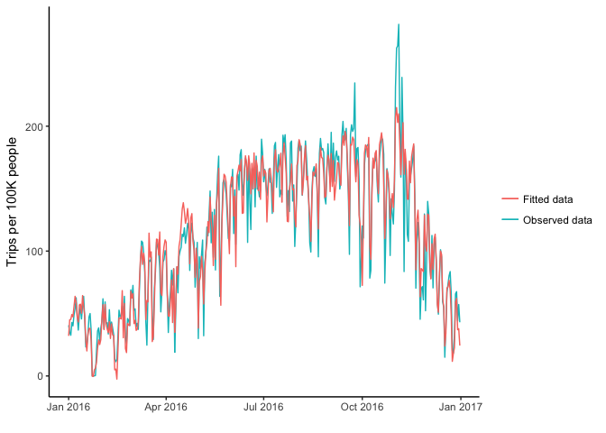
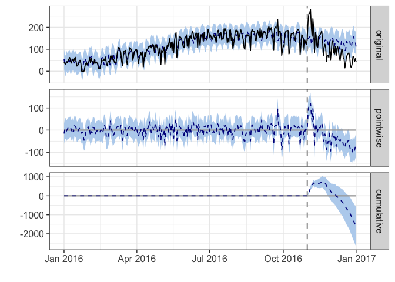
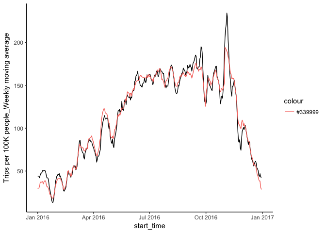

```r
library(stringr)
library(knitr)
library(tidyverse)
```

```
## ── Attaching packages ────────────────────────────────────────────────────────────────────────────────────────────── tidyverse 1.2.1 ──
```

```
## ✔ ggplot2 2.2.1     ✔ readr   1.1.1
## ✔ tibble  1.4.2     ✔ purrr   0.2.4
## ✔ tidyr   0.8.0     ✔ dplyr   0.7.4
## ✔ ggplot2 2.2.1     ✔ forcats 0.3.0
```

```
## ── Conflicts ───────────────────────────────────────────────────────────────────────────────────────────────── tidyverse_conflicts() ──
## ✖ dplyr::filter() masks stats::filter()
## ✖ dplyr::lag()    masks stats::lag()
```

```r
library(lubridate)
```

```
## 
## Attaching package: 'lubridate'
```

```
## The following object is masked from 'package:base':
## 
##     date
```

```r
library(ggplot2)
library(forecast)
library(tseries)
library(formatR)
library(CausalImpact)
```

```
## Loading required package: bsts
```

```
## Loading required package: BoomSpikeSlab
```

```
## Loading required package: Boom
```

```
## Loading required package: MASS
```

```
## 
## Attaching package: 'MASS'
```

```
## The following object is masked from 'package:dplyr':
## 
##     select
```

```
## 
## Attaching package: 'Boom'
```

```
## The following object is masked from 'package:stats':
## 
##     rWishart
```

```
## Loading required package: zoo
```

```
## 
## Attaching package: 'zoo'
```

```
## The following objects are masked from 'package:base':
## 
##     as.Date, as.Date.numeric
```

```
## Loading required package: xts
```

```
## 
## Attaching package: 'xts'
```

```
## The following objects are masked from 'package:dplyr':
## 
##     first, last
```

```r
library(zoo)

options(scipen = 2, digits=4)
opts_chunk$set(warning = FALSE, message = FALSE, error = FALSE, tidy = TRUE)
```


```r
city_data <- read.csv("https://raw.githubusercontent.com/walkabilly/Phillybikeshare/master/city_day_sum.csv")
member_data <- read.csv("https://raw.githubusercontent.com/walkabilly/Phillybikeshare/master/MemberColl.csv")
phil_temp16 <- read.csv("https://raw.githubusercontent.com/walkabilly/Phillybikeshare/master/Phil_temp_2016.csv")
```

### Convert start_time from factor to date and creating moving averages

```r
city_data$start_time <- ymd(city_data$start_time)
member_data$start_time <- mdy(member_data$start_time)

city_data <- city_data %>% 
  arrange(desc(start_time),
         (desc(city))
         )

city_data <- city_data %>%
  group_by(city) %>%
    mutate(
      cnt_ma7 = rollmean(by100000, k = 7, fill = by100000),
      cnt_ma30 = rollmean(by100000, k = 30, fill = by100000),
      cnt_ma = rollmean(cnt_ma7, k = 30, fill = by100000)
      ## ADD Deseason variable
    )

member_data <- member_data %>%
  group_by(city, membertype) %>%
    mutate(
      cnt_ma7 = rollmean(by10000, k = 7, fill = by10000),
      cnt_ma30 = rollmean(by10000, k = 30, fill = by10000),
      cnt_ma = rollmean(cnt_ma7, k = 30, fill = by10000)
    )
```

### Time Series Plot 

#### All bikeshare users (members and non-members)


```r
cityplot <- ggplot(data = city_data, aes(x = start_time, y = by100000)) + geom_line() + 
    stat_smooth(aes(group = dummy), method = "lm", formula = y ~ poly(x, 2), 
        se = FALSE) + geom_vline(xintercept = as.numeric(city_data$start_time[1215]), 
    linetype = 4) + facet_wrap(~city) + theme_classic()


plot(cityplot)
```

<!-- -->

#### Data cleaning Bikeshare member type by city

#### Philadelphia


```r
philly_mem_data <- filter(member_data, city == "Philly")

philly_member_plot <- ggplot(data = philly_mem_data, aes(x = start_time, y = by10000)) + 
    geom_line() + stat_smooth(aes(group = dummy), method = "lm", formula = y ~ 
    poly(x, 2), se = FALSE) + geom_vline(xintercept = as.numeric(city_data$start_time[1215]), 
    linetype = 4) + facet_wrap(~membertype) + theme_classic()

plot(philly_member_plot)
```

<!-- -->

#### Boston


```r
boston_mem_data <- filter(member_data, city == "Boston")

boston_member_plot <- ggplot(data = boston_mem_data, aes(x = start_time, y = by10000)) + 
    geom_line() + stat_smooth(aes(group = dummy), method = "lm", formula = y ~ 
    poly(x, 2), se = FALSE) + geom_vline(xintercept = as.numeric(city_data$start_time[1215]), 
    linetype = 4) + facet_wrap(~membertype) + theme_classic()

plot(boston_member_plot)
```

<!-- -->

#### Chicago


```r
chicago_mem_data <- filter(member_data, city == "Chicago")

chicago_member_plot <- ggplot(data = chicago_mem_data, aes(x = start_time, y = by10000)) + 
    geom_line() + stat_smooth(aes(group = dummy), method = "lm", formula = y ~ 
    poly(x, 2), se = FALSE) + geom_vline(xintercept = as.numeric(city_data$start_time[1215]), 
    linetype = 4) + facet_wrap(~membertype) + theme_classic()

plot(chicago_member_plot)
```

<!-- -->

#### Washington


```r
washington_mem_data <- filter(member_data, city == "Washington")

washington_member_plot <- ggplot(data = washington_mem_data, aes(x = start_time, 
    y = by10000)) + geom_line() + stat_smooth(aes(group = dummy), method = "lm", 
    formula = y ~ poly(x, 2), se = FALSE) + geom_vline(xintercept = as.numeric(city_data$start_time[1215]), 
    linetype = 4) + facet_wrap(~membertype) + theme_classic()

plot(washington_member_plot)
```

<!-- -->

### Data analysis

#### Moving Averages


```r
smooth_plot <- ggplot(city_data) + geom_line(aes(x = start_time, y = by100000, 
    colour = "Count")) + geom_line(aes(x = start_time, y = cnt_ma7, colour = "Weekly Moving Average")) + 
    geom_line(aes(x = start_time, y = cnt_ma30, colour = "Monthly Moving Average")) + 
    geom_vline(xintercept = as.numeric(city_data$start_time[1215]), linetype = 4) + 
    facet_wrap(~city) + theme_classic() + ylab("Number of Trips x 100000 person")
plot(smooth_plot)
```

<!-- -->

#### Linear Model on Total Number of Trips With Weekly and Seasonal Moving Average


```r
lm_city_cnt <- lm(number_trips ~ cnt_ma * dummy * city, data = city_data)
summary(lm_city_cnt)
```

```
## 
## Call:
## lm(formula = number_trips ~ cnt_ma * dummy * city, data = city_data)
## 
## Residuals:
##    Min     1Q Median     3Q    Max 
##  -7656   -582    104    802   8232 
## 
## Coefficients:
##                             Estimate Std. Error t value  Pr(>|t|)    
## (Intercept)                  -62.019    190.165   -0.33      0.74    
## cnt_ma                         6.767      0.308   21.99   < 2e-16 ***
## dummy                        314.725    476.168    0.66      0.51    
## cityChicago                  -78.016    293.935   -0.27      0.79    
## cityPhilly                    71.606    306.398    0.23      0.82    
## cityWashington               238.906    383.803    0.62      0.53    
## cnt_ma:dummy                  -0.434      1.184   -0.37      0.71    
## cnt_ma:cityChicago            20.507      0.598   34.29   < 2e-16 ***
## cnt_ma:cityPhilly              8.720      1.929    4.52 0.0000067 ***
## cnt_ma:cityWashington         -0.143      0.382   -0.37      0.71    
## dummy:cityChicago           -646.748    689.523   -0.94      0.35    
## dummy:cityPhilly            -468.626    751.135   -0.62      0.53    
## dummy:cityWashington         569.724    848.917    0.67      0.50    
## cnt_ma:dummy:cityChicago       2.984      2.358    1.27      0.21    
## cnt_ma:dummy:cityPhilly        3.170      5.314    0.60      0.55    
## cnt_ma:dummy:cityWashington   -0.222      1.339   -0.17      0.87    
## ---
## Signif. codes:  0 '***' 0.001 '**' 0.01 '*' 0.05 '.' 0.1 ' ' 1
## 
## Residual standard error: 1630 on 1448 degrees of freedom
## Multiple R-squared:  0.892,	Adjusted R-squared:  0.891 
## F-statistic:  799 on 15 and 1448 DF,  p-value: <2e-16
```

```r
city_data$lm_cnt_fitted <- lm_city_cnt$fitted.values

lm_plot_cnt <- ggplot(city_data) + geom_line(aes(x = start_time, y = number_trips, 
    colour = "Count")) + geom_line(aes(x = start_time, y = lm_cnt_fitted, colour = "Linear Model with moving averages")) + 
    geom_vline(xintercept = as.numeric(city_data$start_time[1215]), linetype = 4) + 
    facet_wrap(~city) + theme_classic() + ylab("Number of Trips")
plot(lm_plot_cnt)
```

<!-- -->

#### Linear Model on Trips per 100k people With Weekly and Seasonal Moving Average


```r
lm_city_100k <- lm(by100000 ~ cnt_ma * dummy * city, data = city_data)
summary(lm_city_100k)
```

```
## 
## Call:
## lm(formula = by100000 ~ cnt_ma * dummy * city, data = city_data)
## 
## Residuals:
##     Min      1Q  Median      3Q     Max 
## -1070.5   -46.5     9.0    68.7   717.7 
## 
## Coefficients:
##                              Estimate Std. Error t value Pr(>|t|)    
## (Intercept)                  -9.29636   19.86967   -0.47     0.64    
## cnt_ma                        1.01433    0.03216   31.54   <2e-16 ***
## dummy                        47.17542   49.75299    0.95     0.34    
## cityChicago                   4.10139   30.71217    0.13     0.89    
## cityPhilly                    9.90779   32.01435    0.31     0.76    
## cityWashington               35.60990   40.10212    0.89     0.37    
## cnt_ma:dummy                 -0.06502    0.12369   -0.53     0.60    
## cnt_ma:cityChicago           -0.00252    0.06248   -0.04     0.97    
## cnt_ma:cityPhilly            -0.02656    0.20156   -0.13     0.90    
## cnt_ma:cityWashington        -0.02889    0.03994   -0.72     0.47    
## dummy:cityChicago           -59.49266   72.04566   -0.83     0.41    
## dummy:cityPhilly            -56.99137   78.48329   -0.73     0.47    
## dummy:cityWashington         84.39437   88.70014    0.95     0.34    
## cnt_ma:dummy:cityChicago      0.15965    0.24642    0.65     0.52    
## cnt_ma:dummy:cityPhilly       0.23955    0.55520    0.43     0.67    
## cnt_ma:dummy:cityWashington  -0.03248    0.13994   -0.23     0.82    
## ---
## Signif. codes:  0 '***' 0.001 '**' 0.01 '*' 0.05 '.' 0.1 ' ' 1
## 
## Residual standard error: 171 on 1448 degrees of freedom
## Multiple R-squared:  0.91,	Adjusted R-squared:  0.909 
## F-statistic:  980 on 15 and 1448 DF,  p-value: <2e-16
```

```r
city_data$lm_100k_fitted <- lm_city_100k$fitted.values

lm_plot_100k <- ggplot(city_data) + geom_line(aes(x = start_time, y = by100000, 
    colour = "Count")) + geom_line(aes(x = start_time, y = lm_100k_fitted, colour = "Linear Model with moving averages")) + 
    geom_vline(xintercept = as.numeric(city_data$start_time[1215]), linetype = 4) + 
    facet_wrap(~city) + theme_classic() + ylab("Number of Trips x 100000 person")
plot(lm_plot_100k)
```

<!-- -->

### Subset to create datasets for each city


```r
philly_data <- filter(city_data, city == "Philly")
boston_data <- filter(city_data, city == "Boston")
chicago_data <- filter(city_data, city == "Chicago")
washington_data <- filter(city_data, city == "Washington")
```

## Philly CausalImpact


```r
## Arrange the data based on time
philly_data <- arrange(philly_data, start_time)

## Set pre- and post-periods
pre_period <- as.Date(c("2016-01-01", "2016-10-31"))
post_period <- as.Date(c("2016-11-01", "2016-12-31"))
post_period2 <- as.Date(c("2016-11-01", "2016-11-07"))  ##Assess the impact one week after the strike

## Modelling all Phil data
philly_data <- zoo(cbind(philly_data$by100000, phil_temp16$MEAN), as.Date(philly_data$start_time))

## Modelling without covaraites
impact_phil <- CausalImpact(data = philly_data, pre.period = pre_period, post.period = post_period, 
    model.args = list(niter = 5000, nseasons = 7))
summary(impact_phil)
```

```
## Posterior inference {CausalImpact}
## 
##                          Average       Cumulative     
## Actual                   108           6588           
## Prediction (s.d.)        134 (8.7)     8169 (531.3)   
## 95% CI                   [117, 151]    [7157, 9231]   
##                                                       
## Absolute effect (s.d.)   -26 (8.7)     -1581 (531.3)  
## 95% CI                   [-43, -9.3]   [-2644, -569.2]
##                                                       
## Relative effect (s.d.)   -19% (6.5%)   -19% (6.5%)    
## 95% CI                   [-32%, -7%]   [-32%, -7%]    
## 
## Posterior tail-area probability p:   0.00204
## Posterior prob. of a causal effect:  99.79592%
## 
## For more details, type: summary(impact, "report")
```

```r
plot(impact_phil)
```

<!-- -->

```r
## Post-period set as one week after the strike
impact_phil2 <- CausalImpact(data = philly_data, pre.period = pre_period, post.period = post_period2, 
    model.args = list(niter = 5000, nseasons = 7))
summary(impact_phil2)
```

```
## Posterior inference {CausalImpact}
## 
##                          Average      Cumulative 
## Actual                   234          1641       
## Prediction (s.d.)        144 (10)     1011 (72)  
## 95% CI                   [124, 164]   [870, 1151]
##                                                  
## Absolute effect (s.d.)   90 (10)      629 (72)   
## 95% CI                   [70, 110]    [490, 771] 
##                                                  
## Relative effect (s.d.)   62% (7.1%)   62% (7.1%) 
## 95% CI                   [48%, 76%]   [48%, 76%] 
## 
## Posterior tail-area probability p:   0.0002
## Posterior prob. of a causal effect:  99.97959%
## 
## For more details, type: summary(impact, "report")
```

```r
## Modelling with covaraites: temperature
impact_phil3 <- CausalImpact(data = philly_data, pre.period = pre_period, post.period = post_period, 
    model.args = list(niter = 5000, nseasons = 7))
summary(impact_phil3)
```

```
## Posterior inference {CausalImpact}
## 
##                          Average         Cumulative     
## Actual                   108             6588           
## Prediction (s.d.)        134 (8.7)       8169 (528.4)   
## 95% CI                   [118, 152]      [7173, 9250]   
##                                                         
## Absolute effect (s.d.)   -26 (8.7)       -1581 (528.4)  
## 95% CI                   [-44, -9.6]     [-2662, -585.5]
##                                                         
## Relative effect (s.d.)   -19% (6.5%)     -19% (6.5%)    
## 95% CI                   [-33%, -7.2%]   [-33%, -7.2%]  
## 
## Posterior tail-area probability p:   0.00082
## Posterior prob. of a causal effect:  99.91837%
## 
## For more details, type: summary(impact, "report")
```

```r
plot(impact_phil3)
```

<!-- -->

```r
# ##Dynamic regression: whether to include a time-varying regression
# coefficient. Default is FALSE impact_phil4 <- CausalImpact(data = data,
# pre.period = pre.period, post.period = post.period, model.args =
# list(niter=5000, nseasons=7, dynamic.regression=T)) ##Control monthly
# effect impact_phil5 <- CausalImpact(data = data, pre.period = pre.period,
# post.period = post.period, model.args = list(niter=5000, nseasons=12,
# season.duration= 30)) ##Control seasonal effect impact_phil6 <-
# CausalImpact(data = data, pre.period = pre.period, post.period =
# post.period, model.args = list(niter=5000, nseasons=4))

# plot(impact_phil4) ##Not a good fit!!!  plot(impact_phil5) ##Not a good
# fit!!!  plot(impact_phil6) ##Not a good fit!!!
```

##Modelling Philadelphia data based on membership

```r
# philly_member_data <- filter(philly_mem_data, membertype == 'member')
# philly_member_data$start_time <- mdy(philly_member_data$start_time)

# philly_member_data <- arrange(philly_member_data, start_time)

# philly_data_mem <- zoo(cbind(philly_member_data$by10000,
# philly_member_data$start_time))

# impact_pil_mem <- CausalImpact(data = philly_data_mem, pre.period =
# pre_period, post.period = post_period, model.args = list(niter=5000,
# nseasons=7))
```

## Boston data analysis

```r
boston_data <- zoo(cbind(boston_data$by100000), as.Date(boston_data$start_time))

impact_bos <- CausalImpact(data = boston_data, pre.period = pre_period, post.period = post_period, 
    model.args = list(niter = 5000, nseasons = 7))
summary(impact_bos)
```

```
## Posterior inference {CausalImpact}
## 
##                          Average        Cumulative     
## Actual                   356            21719          
## Prediction (s.d.)        619 (80)       37763 (4884)   
## 95% CI                   [460, 774]     [28079, 47197] 
##                                                        
## Absolute effect (s.d.)   -263 (80)      -16044 (4884)  
## 95% CI                   [-418, -104]   [-25478, -6360]
##                                                        
## Relative effect (s.d.)   -42% (13%)     -42% (13%)     
## 95% CI                   [-67%, -17%]   [-67%, -17%]   
## 
## Posterior tail-area probability p:   0.00084
## Posterior prob. of a causal effect:  99.91588%
## 
## For more details, type: summary(impact, "report")
```

```r
plot(impact_bos)
```

<!-- -->

## Chicago data anlysis 

```r
chicago_data <- zoo(cbind(chicago_data$by100000), as.Date(chicago_data$start_time))

impact_chi <- CausalImpact(data = chicago_data, pre.period = pre_period, post.period = post_period, 
    model.args = list(niter = 5000, nseasons = 7))

plot(impact_chi)  ##Not a good fit to the data
```

<!-- -->

## Washington data anlysis 

```r
washington_data <- zoo(cbind(washington_data$by100000), as.Date(washington_data$start_time))

impact_DC <- CausalImpact(data = washington_data, pre.period = pre_period, post.period = post_period, 
    model.args = list(niter = 5000, nseasons = 7))

plot(impact_DC)  ##Not a good fit to the data
```

<!-- -->


