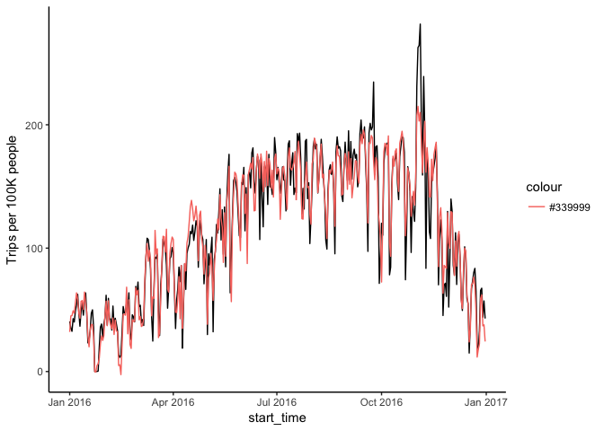
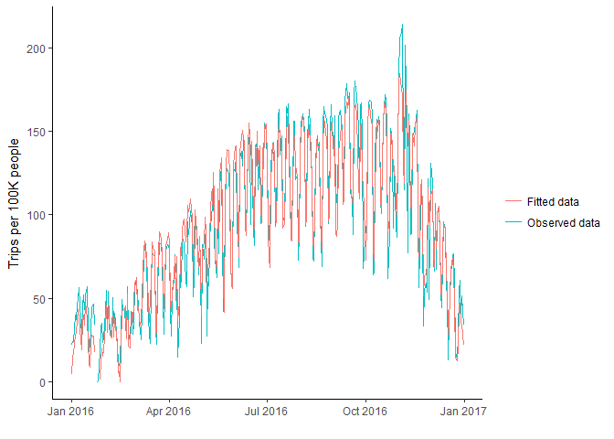

```r
library(stringr)
library(knitr)
library(tidyverse)
```

```
## Warning: package 'tidyverse' was built under R version 3.4.4
```

```
## -- Attaching packages ---------------------------------- tidyverse 1.2.1 --
```

```
## v ggplot2 2.2.1     v readr   1.1.1
## v tibble  1.4.2     v purrr   0.2.4
## v tidyr   0.8.0     v dplyr   0.7.4
## v ggplot2 2.2.1     v forcats 0.3.0
```

```
## Warning: package 'tidyr' was built under R version 3.4.4
```

```
## Warning: package 'purrr' was built under R version 3.4.4
```

```
## Warning: package 'forcats' was built under R version 3.4.4
```

```
## -- Conflicts ------------------------------------- tidyverse_conflicts() --
## x dplyr::filter() masks stats::filter()
## x dplyr::lag()    masks stats::lag()
```

```r
library(lubridate)
```

```
## Warning: package 'lubridate' was built under R version 3.4.4
```

```
## 
## Attaching package: 'lubridate'
```

```
## The following object is masked from 'package:base':
## 
##     date
```

```r
library(ggplot2)
library(forecast)
```

```
## Warning: package 'forecast' was built under R version 3.4.4
```

```r
library(tseries)
```

```
## Warning: package 'tseries' was built under R version 3.4.4
```

```r
library(formatR)
```

```
## Warning: package 'formatR' was built under R version 3.4.4
```

```r
library(CausalImpact)
```

```
## Warning: package 'CausalImpact' was built under R version 3.4.4
```

```
## Loading required package: bsts
```

```
## Warning: package 'bsts' was built under R version 3.4.4
```

```
## Loading required package: BoomSpikeSlab
```

```
## Warning: package 'BoomSpikeSlab' was built under R version 3.4.4
```

```
## Loading required package: Boom
```

```
## Warning: package 'Boom' was built under R version 3.4.4
```

```
## Loading required package: MASS
```

```
## 
## Attaching package: 'MASS'
```

```
## The following object is masked from 'package:dplyr':
## 
##     select
```

```
## 
## Attaching package: 'Boom'
```

```
## The following object is masked from 'package:stats':
## 
##     rWishart
```

```
## Loading required package: zoo
```

```
## Warning: package 'zoo' was built under R version 3.4.4
```

```
## 
## Attaching package: 'zoo'
```

```
## The following objects are masked from 'package:base':
## 
##     as.Date, as.Date.numeric
```

```
## Loading required package: xts
```

```
## Warning: package 'xts' was built under R version 3.4.4
```

```
## 
## Attaching package: 'xts'
```

```
## The following objects are masked from 'package:dplyr':
## 
##     first, last
```

```r
library(zoo)
library(normtest)
library(car)
```

```
## 
## Attaching package: 'car'
```

```
## The following object is masked from 'package:dplyr':
## 
##     recode
```

```
## The following object is masked from 'package:purrr':
## 
##     some
```

```r
options(scipen = 2, digits=4)
opts_chunk$set(warning = FALSE, message = FALSE, error = FALSE, tidy = TRUE)
```


```r
city_data <- read.csv("https://raw.githubusercontent.com/walkabilly/Phillybikeshare/master/city_day_sum.csv")
member_data <- read.csv("https://raw.githubusercontent.com/walkabilly/Phillybikeshare/master/MemberColl.csv")
phil_temp16 <- read.csv("https://raw.githubusercontent.com/walkabilly/Phillybikeshare/master/Phil_temp_2016.csv")
```

### Convert start_time from factor to date and creating moving averages

```r
city_data$start_time <- ymd(city_data$start_time)
member_data$start_time <- mdy(member_data$start_time)

city_data <- city_data %>% 
  arrange(desc(start_time),
         (desc(city))
         )

city_data <- city_data %>%
  group_by(city) %>%
    mutate(
      cnt_ma7 = rollmean(by100000, k = 7, fill = by100000),
      cnt_ma30 = rollmean(by100000, k = 30, fill = by100000),
      cnt_ma = rollmean(cnt_ma7, k = 30, fill = by100000)
      ## ADD Deseason variable
    )

member_data <- member_data %>%
  group_by(city, membertype) %>%
    mutate(
      cnt_ma7 = rollmean(by10000, k = 7, fill = by10000),
      cnt_ma30 = rollmean(by10000, k = 30, fill = by10000),
      cnt_ma = rollmean(cnt_ma7, k = 30, fill = by10000)
    )
```

### Time Series Plot 

#### All bikeshare users (members and non-members)


```r
cityplot <- ggplot(data = city_data, aes(x = start_time, y = by100000)) + geom_line() + 
    stat_smooth(aes(group = dummy), method = "lm", formula = y ~ poly(x, 2), 
        se = FALSE) + geom_vline(xintercept = as.numeric(city_data$start_time[""]), 
    linetype = 4) + facet_wrap(~city) + theme_classic()


plot(cityplot)
```

<!-- -->

#### Data cleaning Bikeshare member type by city

#### Philadelphia


```r
philly_mem_data <- filter(member_data, city == "Philly")

philly_member_plot <- ggplot(data = philly_mem_data, aes(x = start_time, y = by10000)) + 
    geom_line() + stat_smooth(aes(group = dummy), method = "lm", formula = y ~ 
    poly(x, 2), se = FALSE) + geom_vline(xintercept = as.numeric(city_data$start_time[1215]), 
    linetype = 4) + facet_wrap(~membertype) + theme_classic()

plot(philly_member_plot)
```

<!-- -->

#### Boston


```r
boston_mem_data <- filter(member_data, city == "Boston")

boston_member_plot <- ggplot(data = boston_mem_data, aes(x = start_time, y = by10000)) + 
    geom_line() + stat_smooth(aes(group = dummy), method = "lm", formula = y ~ 
    poly(x, 2), se = FALSE) + geom_vline(xintercept = as.numeric(city_data$start_time[1215]), 
    linetype = 4) + facet_wrap(~membertype) + theme_classic()

plot(boston_member_plot)
```

<!-- -->

#### Chicago


```r
chicago_mem_data <- filter(member_data, city == "Chicago")

chicago_member_plot <- ggplot(data = chicago_mem_data, aes(x = start_time, y = by10000)) + 
    geom_line() + stat_smooth(aes(group = dummy), method = "lm", formula = y ~ 
    poly(x, 2), se = FALSE) + geom_vline(xintercept = as.numeric(city_data$start_time[1215]), 
    linetype = 4) + facet_wrap(~membertype) + theme_classic()

plot(chicago_member_plot)
```

<!-- -->

#### Washington


```r
washington_mem_data <- filter(member_data, city == "Washington")

washington_member_plot <- ggplot(data = washington_mem_data, aes(x = start_time, 
    y = by10000)) + geom_line() + stat_smooth(aes(group = dummy), method = "lm", 
    formula = y ~ poly(x, 2), se = FALSE) + geom_vline(xintercept = as.numeric(city_data$start_time[1215]), 
    linetype = 4) + facet_wrap(~membertype) + theme_classic()

plot(washington_member_plot)
```

<!-- -->

### Data analysis

#### Moving Averages


```r
smooth_plot <- ggplot(city_data) + geom_line(aes(x = start_time, y = by100000, 
    colour = "Count")) + geom_line(aes(x = start_time, y = cnt_ma7, colour = "Weekly Moving Average")) + 
    geom_line(aes(x = start_time, y = cnt_ma30, colour = "Monthly Moving Average")) + 
    geom_vline(xintercept = as.numeric(city_data$start_time[1215]), linetype = 4) + 
    facet_wrap(~city) + theme_classic() + ylab("Number of Trips x 100000 person")
plot(smooth_plot)
```

<!-- -->


### Linear Model on Trips per 100K people
### Covaraites: (1) daily average temperature; (2) daily average precipitation; (3) dummy varaible: 0 - no strike, 1 - strike; (4) Trips per 100K, Boston; (5) Trips per 100K, Washington DC; (6) Trips per 100K, Chicago; (7) time; (8) Interaction between time and dummy


```r
trip_Philly <- arrange(dplyr::select(filter(city_data, city == "Philly"), by100000, 
    dummy, start_time), start_time)
trip_Boston <- arrange(dplyr::select(filter(city_data, city == "Boston"), by100000, 
    start_time), start_time)
trip_Washington <- arrange(dplyr::select(filter(city_data, city == "Washington"), 
    by100000, start_time), start_time)
trip_Chicago <- arrange(dplyr::select(filter(city_data, city == "Chicago"), 
    by100000, start_time), start_time)

time <- 1:366

lm_tripRate <- lm(trip_Philly$by100000 ~ phil_temp16$MEAN + phil_temp16$PRCP + 
    trip_Philly$dummy + trip_Boston$by100000 + trip_Washington$by100000 + trip_Chicago$by100000 + 
    time + time * trip_Philly$dummy)

summary(lm_tripRate)
```

```
## 
## Call:
## lm(formula = trip_Philly$by100000 ~ phil_temp16$MEAN + phil_temp16$PRCP + 
##     trip_Philly$dummy + trip_Boston$by100000 + trip_Washington$by100000 + 
##     trip_Chicago$by100000 + time + time * trip_Philly$dummy)
## 
## Residuals:
##    Min     1Q Median     3Q    Max 
## -77.41  -8.01   0.53   8.21  76.36 
## 
## Coefficients:
##                           Estimate Std. Error t value Pr(>|t|)    
## (Intercept)               -3.20514    4.10611   -0.78    0.436    
## phil_temp16$MEAN          -0.20528    0.10243   -2.00    0.046 *  
## phil_temp16$PRCP          -4.91943    2.04840   -2.40    0.017 *  
## trip_Philly$dummy        439.49308   44.39220    9.90   <2e-16 ***
## trip_Boston$by100000       0.07404    0.00609   12.16   <2e-16 ***
## trip_Washington$by100000   0.04966    0.00291   17.04   <2e-16 ***
## trip_Chicago$by100000      0.01614    0.00875    1.85    0.066 .  
## time                       0.10021    0.01768    5.67    3e-08 ***
## trip_Philly$dummy:time    -1.29009    0.13678   -9.43   <2e-16 ***
## ---
## Signif. codes:  0 '***' 0.001 '**' 0.01 '*' 0.05 '.' 0.1 ' ' 1
## 
## Residual standard error: 16.3 on 357 degrees of freedom
## Multiple R-squared:  0.919,	Adjusted R-squared:  0.917 
## F-statistic:  504 on 8 and 357 DF,  p-value: <2e-16
```

```r
tripPhilly_fitted <- lm_tripRate$fitted.values
lm_plot_tripRate <- ggplot(trip_Philly) + geom_line(aes(x = start_time, y = by100000)) + 
    geom_line(aes(x = start_time, y = tripPhilly_fitted, colour = "#339999")) + 
    theme_classic() + ylab("Trips per 100K people")

plot(lm_plot_tripRate)
```

<!-- -->

```r
### Accounting for the potential quadratic trend of the data (time squared).
### This term captures the curvature of the trend
lm_tripRate2 <- lm(trip_Philly$by100000 ~ phil_temp16$MEAN + phil_temp16$PRCP + 
    trip_Philly$dummy + trip_Boston$by100000 + trip_Washington$by100000 + trip_Chicago$by100000 + 
    poly(time, 2) + time * trip_Philly$dummy)  ##Code for time squared interaction is I(time^2)*trip_Philly$dummy

summary(lm_tripRate2)
```

```
## 
## Call:
## lm(formula = trip_Philly$by100000 ~ phil_temp16$MEAN + phil_temp16$PRCP + 
##     trip_Philly$dummy + trip_Boston$by100000 + trip_Washington$by100000 + 
##     trip_Chicago$by100000 + poly(time, 2) + time * trip_Philly$dummy)
## 
## Residuals:
##    Min     1Q Median     3Q    Max 
## -78.66  -7.82   0.34   7.29  70.53 
## 
## Coefficients: (1 not defined because of singularities)
##                           Estimate Std. Error t value Pr(>|t|)    
## (Intercept)               -8.57152    6.06254   -1.41   0.1583    
## phil_temp16$MEAN           0.02138    0.10284    0.21   0.8354    
## phil_temp16$PRCP          -3.99459    1.94240   -2.06   0.0405 *  
## trip_Philly$dummy        461.15602   42.11353   10.95  < 2e-16 ***
## trip_Boston$by100000       0.08240    0.00590   13.98  < 2e-16 ***
## trip_Washington$by100000   0.05203    0.00278   18.72  < 2e-16 ***
## trip_Chicago$by100000      0.02750    0.00845    3.25   0.0012 ** 
## poly(time, 2)1           177.13589   34.02814    5.21  3.3e-07 ***
## poly(time, 2)2           231.82291   35.30061    6.57  1.8e-10 ***
## time                            NA         NA      NA       NA    
## trip_Philly$dummy:time    -1.37708    0.13004  -10.59  < 2e-16 ***
## ---
## Signif. codes:  0 '***' 0.001 '**' 0.01 '*' 0.05 '.' 0.1 ' ' 1
## 
## Residual standard error: 15.4 on 356 degrees of freedom
## Multiple R-squared:  0.927,	Adjusted R-squared:  0.926 
## F-statistic:  506 on 9 and 356 DF,  p-value: <2e-16
```

```r
tripPhilly_fitted2 <- lm_tripRate2$fitted.values
lm_plot_tripRate2 <- ggplot(trip_Philly) + geom_line(aes(x = start_time, y = by100000)) + 
    geom_line(aes(x = start_time, y = tripPhilly_fitted2, colour = "#339999")) + 
    theme_classic() + ylab("Trips per 100K people")

plot(lm_plot_tripRate2)
```

<!-- -->


###Linear model on Trips per 100K people, weekly moving average

```r
trip_Philly_MA <- arrange(dplyr::select(filter(city_data, city == "Philly"), 
    cnt_ma7, dummy, start_time), start_time)
trip_Boston_MA <- arrange(dplyr::select(filter(city_data, city == "Boston"), 
    cnt_ma7, start_time), start_time)
trip_Washington_MA <- arrange(dplyr::select(filter(city_data, city == "Washington"), 
    cnt_ma7, start_time), start_time)
trip_Chicago_MA <- arrange(dplyr::select(filter(city_data, city == "Chicago"), 
    cnt_ma7, start_time), start_time)

time_MA <- 1:366

lm_tripRate_MA <- lm(trip_Philly_MA$cnt_ma7 ~ phil_temp16$MEAN + phil_temp16$PRCP + 
    trip_Philly_MA$dummy + trip_Boston_MA$cnt_ma7 + trip_Washington_MA$cnt_ma7 + 
    trip_Chicago_MA$cnt_ma7 + time_MA + time_MA * trip_Philly_MA$dummy)

summary(lm_tripRate_MA)
```

```
## 
## Call:
## lm(formula = trip_Philly_MA$cnt_ma7 ~ phil_temp16$MEAN + phil_temp16$PRCP + 
##     trip_Philly_MA$dummy + trip_Boston_MA$cnt_ma7 + trip_Washington_MA$cnt_ma7 + 
##     trip_Chicago_MA$cnt_ma7 + time_MA + time_MA * trip_Philly_MA$dummy)
## 
## Residuals:
##    Min     1Q Median     3Q    Max 
## -25.38  -5.13  -0.89   4.61  44.54 
## 
## Coefficients:
##                               Estimate Std. Error t value Pr(>|t|)    
## (Intercept)                    0.47913    2.52384    0.19    0.850    
## phil_temp16$MEAN              -0.05597    0.06324   -0.89    0.377    
## phil_temp16$PRCP              -2.06822    1.05994   -1.95    0.052 .  
## trip_Philly_MA$dummy         494.08561   25.43292   19.43  < 2e-16 ***
## trip_Boston_MA$cnt_ma7         0.04385    0.00696    6.30  8.7e-10 ***
## trip_Washington_MA$cnt_ma7     0.03184    0.00239   13.30  < 2e-16 ***
## trip_Chicago_MA$cnt_ma7        0.06415    0.01004    6.39  5.2e-10 ***
## time_MA                        0.16211    0.01149   14.11  < 2e-16 ***
## trip_Philly_MA$dummy:time_MA  -1.49235    0.07944  -18.79  < 2e-16 ***
## ---
## Signif. codes:  0 '***' 0.001 '**' 0.01 '*' 0.05 '.' 0.1 ' ' 1
## 
## Residual standard error: 8.56 on 357 degrees of freedom
## Multiple R-squared:  0.972,	Adjusted R-squared:  0.972 
## F-statistic: 1.56e+03 on 8 and 357 DF,  p-value: <2e-16
```

```r
tripPhilly_fitted_MA <- lm_tripRate_MA$fitted.values
lm_plot_tripRate_MA <- ggplot(trip_Philly_MA) + geom_line(aes(x = start_time, 
    y = cnt_ma7)) + geom_line(aes(x = start_time, y = tripPhilly_fitted_MA, 
    colour = "#339999")) + theme_classic() + ylab("Trips per 100K people_Weekly moving average")

plot(lm_plot_tripRate_MA)
```

<!-- -->

```r
### Accounting for the potential quadratic trend of the data (time squared).
### This term captures the curvature of the trend
lm_tripRate_MA2 <- lm(trip_Philly_MA$cnt_ma7 ~ phil_temp16$MEAN + phil_temp16$PRCP + 
    trip_Philly_MA$dummy + trip_Boston_MA$cnt_ma7 + trip_Washington_MA$cnt_ma7 + 
    trip_Chicago_MA$cnt_ma7 + poly(time_MA, 2) + time_MA * trip_Philly_MA$dummy)

summary(lm_tripRate_MA2)
```

```
## 
## Call:
## lm(formula = trip_Philly_MA$cnt_ma7 ~ phil_temp16$MEAN + phil_temp16$PRCP + 
##     trip_Philly_MA$dummy + trip_Boston_MA$cnt_ma7 + trip_Washington_MA$cnt_ma7 + 
##     trip_Chicago_MA$cnt_ma7 + poly(time_MA, 2) + time_MA * trip_Philly_MA$dummy)
## 
## Residuals:
##    Min     1Q Median     3Q    Max 
## -21.00  -3.94   0.19   3.05  41.87 
## 
## Coefficients: (1 not defined because of singularities)
##                               Estimate Std. Error t value Pr(>|t|)    
## (Intercept)                    2.99580    3.47796    0.86     0.39    
## phil_temp16$MEAN               0.00815    0.05421    0.15     0.88    
## phil_temp16$PRCP              -1.03466    0.90822   -1.14     0.26    
## trip_Philly_MA$dummy         459.81057   21.88761   21.01  < 2e-16 ***
## trip_Boston_MA$cnt_ma7         0.06572    0.00623   10.55  < 2e-16 ***
## trip_Washington_MA$cnt_ma7     0.04036    0.00217   18.60  < 2e-16 ***
## trip_Chicago_MA$cnt_ma7        0.06645    0.00857    7.76  9.2e-14 ***
## poly(time_MA, 2)1            242.54267   21.11456   11.49  < 2e-16 ***
## poly(time_MA, 2)2            220.20930   18.95678   11.62  < 2e-16 ***
## time_MA                             NA         NA      NA       NA    
## trip_Philly_MA$dummy:time_MA  -1.39225    0.06829  -20.39  < 2e-16 ***
## ---
## Signif. codes:  0 '***' 0.001 '**' 0.01 '*' 0.05 '.' 0.1 ' ' 1
## 
## Residual standard error: 7.3 on 356 degrees of freedom
## Multiple R-squared:  0.98,	Adjusted R-squared:  0.979 
## F-statistic: 1.92e+03 on 9 and 356 DF,  p-value: <2e-16
```

```r
tripPhilly_fitted_MA2 <- lm_tripRate_MA2$fitted.values
lm_plot_tripRate_MA2 <- ggplot(trip_Philly_MA) + geom_line(aes(x = start_time, 
    y = cnt_ma7)) + geom_line(aes(x = start_time, y = tripPhilly_fitted_MA2, 
    colour = "#339999")) + theme_classic() + ylab("Trips per 100K people_Weekly moving average")

plot(lm_plot_tripRate_MA2)
```

<!-- -->


### Subset to create datasets for each city


```r
philly_data <- filter(city_data, city == "Philly")
boston_data <- filter(city_data, city == "Boston")
chicago_data <- filter(city_data, city == "Chicago")
washington_data <- filter(city_data, city == "Washington")
```

## Philly CausalImpact


```r
## Arrange the data based on time
philly_data <- arrange(philly_data, start_time)

## Set pre- and post-periods
pre_period <- as.Date(c("2016-01-01", "2016-10-31"))
post_period <- as.Date(c("2016-11-01", "2016-12-31"))
post_period2 <- as.Date(c("2016-11-01", "2016-11-07"))  ##Assess the impact one week after the strike

## Modelling all Phil data
philly_data <- zoo(cbind(philly_data$by100000, phil_temp16$MEAN), as.Date(philly_data$start_time))

## Modelling without covaraites
impact_phil <- CausalImpact(data = philly_data, pre.period = pre_period, post.period = post_period, 
    model.args = list(niter = 5000, nseasons = 7))
summary(impact_phil)
```

```
## Posterior inference {CausalImpact}
## 
##                          Average         Cumulative     
## Actual                   108             6588           
## Prediction (s.d.)        133 (8.9)       8140 (540.0)   
## 95% CI                   [116, 151]      [7106, 9225]   
##                                                         
## Absolute effect (s.d.)   -25 (8.9)       -1552 (540.0)  
## 95% CI                   [-43, -8.5]     [-2637, -518.6]
##                                                         
## Relative effect (s.d.)   -19% (6.6%)     -19% (6.6%)    
## 95% CI                   [-32%, -6.4%]   [-32%, -6.4%]  
## 
## Posterior tail-area probability p:   0.00227
## Posterior prob. of a causal effect:  99.77343%
## 
## For more details, type: summary(impact, "report")
```

```r
plot(impact_phil)
```

<!-- -->

```r
## Post-period set as one week after the strike
impact_phil2 <- CausalImpact(data = philly_data, pre.period = pre_period, post.period = post_period2, 
    model.args = list(niter = 5000, nseasons = 7))
summary(impact_phil2)
```

```
## Posterior inference {CausalImpact}
## 
##                          Average      Cumulative 
## Actual                   234          1641       
## Prediction (s.d.)        144 (10)     1009 (73)  
## 95% CI                   [124, 165]   [865, 1158]
##                                                  
## Absolute effect (s.d.)   90 (10)      631 (73)   
## 95% CI                   [69, 111]    [483, 775] 
##                                                  
## Relative effect (s.d.)   63% (7.2%)   63% (7.2%) 
## 95% CI                   [48%, 77%]   [48%, 77%] 
## 
## Posterior tail-area probability p:   0.00021
## Posterior prob. of a causal effect:  99.9794%
## 
## For more details, type: summary(impact, "report")
```

```r
## Modelling with covaraites: temperature
impact_phil3 <- CausalImpact(data = philly_data, pre.period = pre_period, post.period = post_period, 
    model.args = list(niter = 5000, nseasons = 7))
summary(impact_phil3)
```

```
## Posterior inference {CausalImpact}
## 
##                          Average         Cumulative     
## Actual                   108             6588           
## Prediction (s.d.)        133 (8.8)       8140 (535.0)   
## 95% CI                   [116, 151]      [7093, 9222]   
##                                                         
## Absolute effect (s.d.)   -25 (8.8)       -1552 (535.0)  
## 95% CI                   [-43, -8.3]     [-2634, -505.3]
##                                                         
## Relative effect (s.d.)   -19% (6.6%)     -19% (6.6%)    
## 95% CI                   [-32%, -6.2%]   [-32%, -6.2%]  
## 
## Posterior tail-area probability p:   0.00165
## Posterior prob. of a causal effect:  99.83522%
## 
## For more details, type: summary(impact, "report")
```

```r
plot(impact_phil3)
```

<!-- -->

```r
# ##Dynamic regression: whether to include a time-varying regression
# coefficient. Default is FALSE impact_phil4 <- CausalImpact(data = data,
# pre.period = pre.period, post.period = post.period, model.args =
# list(niter=5000, nseasons=7, dynamic.regression=T)) ##Control monthly
# effect impact_phil5 <- CausalImpact(data = data, pre.period = pre.period,
# post.period = post.period, model.args = list(niter=5000, nseasons=12,
# season.duration= 30)) ##Control seasonal effect impact_phil6 <-
# CausalImpact(data = data, pre.period = pre.period, post.period =
# post.period, model.args = list(niter=5000, nseasons=4))

# plot(impact_phil4) ##Not a good fit!!!  plot(impact_phil5) ##Not a good
# fit!!!  plot(impact_phil6) ##Not a good fit!!!
```

##Modelling Philadelphia data based on membership

```r
# philly_member_data <- filter(philly_mem_data, membertype == 'member')
# philly_member_data$start_time <- mdy(philly_member_data$start_time)

# philly_member_data <- arrange(philly_member_data, start_time)

# philly_data_mem <- zoo(cbind(philly_member_data$by10000,
# philly_member_data$start_time))

# impact_pil_mem <- CausalImpact(data = philly_data_mem, pre.period =
# pre_period, post.period = post_period, model.args = list(niter=5000,
# nseasons=7))
```

## Boston data analysis

```r
boston_data <- zoo(cbind(boston_data$by100000), as.Date(boston_data$start_time))

impact_bos <- CausalImpact(data = boston_data, pre.period = pre_period, post.period = post_period, 
    model.args = list(niter = 5000, nseasons = 7))
summary(impact_bos)
```

```
## Posterior inference {CausalImpact}
## 
##                          Average        Cumulative     
## Actual                   356            21719          
## Prediction (s.d.)        617 (82)       37616 (5029)   
## 95% CI                   [449, 774]     [27390, 47243] 
##                                                        
## Absolute effect (s.d.)   -261 (82)      -15897 (5029)  
## 95% CI                   [-418, -93]    [-25523, -5670]
##                                                        
## Relative effect (s.d.)   -42% (13%)     -42% (13%)     
## 95% CI                   [-68%, -15%]   [-68%, -15%]   
## 
## Posterior tail-area probability p:   0.00253
## Posterior prob. of a causal effect:  99.74684%
## 
## For more details, type: summary(impact, "report")
```

```r
plot(impact_bos)
```

<!-- -->

## Chicago data anlysis 

```r
chicago_data <- zoo(cbind(chicago_data$by100000), as.Date(chicago_data$start_time))

impact_chi <- CausalImpact(data = chicago_data, pre.period = pre_period, post.period = post_period, 
    model.args = list(niter = 5000, nseasons = 7))
summary(impact_chi)
```

```
## Posterior inference {CausalImpact}
## 
##                          Average        Cumulative     
## Actual                   203            12377          
## Prediction (s.d.)        399 (53)       24369 (3259)   
## 95% CI                   [291, 504]     [17732, 30753] 
##                                                        
## Absolute effect (s.d.)   -197 (53)      -11991 (3259)  
## 95% CI                   [-301, -88]    [-18376, -5355]
##                                                        
## Relative effect (s.d.)   -49% (13%)     -49% (13%)     
## 95% CI                   [-75%, -22%]   [-75%, -22%]   
## 
## Posterior tail-area probability p:   0.00063
## Posterior prob. of a causal effect:  99.93691%
## 
## For more details, type: summary(impact, "report")
```

```r
plot(impact_chi)  ##Not a good fit to the data
```

<!-- -->

## Washington data anlysis 

```r
washington_data <- zoo(cbind(washington_data$by100000), as.Date(washington_data$start_time))

impact_DC <- CausalImpact(data = washington_data, pre.period = pre_period, post.period = post_period, 
    model.args = list(niter = 5000, nseasons = 7))
summary(impact_DC)
```

```
## Posterior inference {CausalImpact}
## 
##                          Average        Cumulative      
## Actual                   1043           63643           
## Prediction (s.d.)        1648 (140)     100532 (8510)   
## 95% CI                   [1367, 1924]   [83398, 117378] 
##                                                         
## Absolute effect (s.d.)   -605 (140)     -36889 (8510)   
## 95% CI                   [-881, -324]   [-53735, -19755]
##                                                         
## Relative effect (s.d.)   -37% (8.5%)    -37% (8.5%)     
## 95% CI                   [-53%, -20%]   [-53%, -20%]    
## 
## Posterior tail-area probability p:   0.00021
## Posterior prob. of a causal effect:  99.9789%
## 
## For more details, type: summary(impact, "report")
```

```r
plot(impact_DC)  ##Not a good fit to the data
```

<!-- -->


